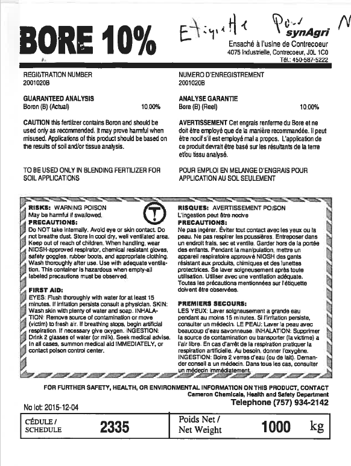

# Observe: label_002

## Images




## Extraction

### Result
```json
{
  "brand_name": {
    "en": "synAgri",
    "fr": null
  },
  "product_name": {
    "en": "BORE 10%",
    "fr": null
  },
  "contacts": [
    {
      "type": "manufacturer",
      "name": "Cameron Chemicals, Health and Safety Department",
      "address": "Ensaché à l'usine de Contrecoeur, 4075 Industrielle, Contrecoeur, J0L 1C0",
      "phone": "(757) 934-2142",
      "email": null,
      "website": null
    }
  ],
  "registration_number": "2001020B",
  "registration_claim": null,
  "lot_number": "2015-12-04",
  "net_weight": "1000 kg",
  "volume": null,
  "exemption_claim": null,
  "country_of_origin": null,
  "product_classification": null,
  "customer_formula_statements": null,
  "intended_use_statements": null,
  "processing_instruction_statements": null,
  "experimental_statements": null,
  "export_statements": null,
  "n": null,
  "p": null,
  "k": null,
  "ingredients": null,
  "guaranteed_analysis": {
    "title": {
      "en": "GUARANTEED ANALYSIS",
      "fr": "ANALYSE GARANTIE"
    },
    "is_minimum": false,
    "nutrients": [
      {
        "name": {
          "en": "Boron (B) (Actual)",
          "fr": "Bore (B) (Reel)"
        },
        "value": "10.00",
        "unit": "%"
      }
    ]
  },
  "precaution_statements": [
    {
      "en": "CAUTION this fertilizer contains Boron and should be used only as recommended. It may prove harmful when misused. Applications of this product should be based on the results of soil and/or tissue analysis.",
      "fr": "AVERTISSEMENT Cet engrais renferme du Bore et ne doit être employé que de la manière recommandée. Il peut être nocif s'il est employé mal à propos. L'application de ce produit devrait être basé sur les résultats de la terre et/ou tissu analysés."
    },
    {
      "en": "RISKS: WARNING POISON May be harmful if swallowed.",
      "fr": "RISQUES: AVERTISSEMENT POISON L'ingestion peut être nocive"
    },
    {
      "en": "PRECAUTIONS: Do Not take internally. Avoid eye or skin contact. Do not breathe dust. Store in cool dry, well ventilated area. Keep out of reach of children. When handling, wear NIOSH-approved respirator, chemical resistant gloves, safety goggles, rubber boots, and appropriate clothing. Wash thoroughly after use. Use with adequate ventilation. This container is hazardous when empty-all labeled precautions must be observed.",
      "fr": "PRECAUTIONS: Ne pas ingérer. Éviter tout contact avec les yeux ou la peau. Ne pas respirer les poussières. Entreposer dans un endroit frais, sec et ventilé. Garder hors de la portée des enfants. Lors de la manipulation, mettre un appareil respiratoire approuvé NIOSH des gants résistant aux produits chimiques et des lunettes de sécurité. Se laver soigneusement après toute utilisation. Utiliser avec une ventilation adéquate. Toutes les précautions mentionnées sur l'étiquette doivent être observées."
    }
  ],
  "directions_for_use_statements": [
    {
      "en": "TO BE USED ONLY IN BLENDING FERTILIZER FOR SOIL APPLICATIONS",
      "fr": "POUR EMPLOI EN MELANGE D'ENGRAIS POUR APPLICATION AU SOL SEULEMENT"
    }
  ]
}
```

### Usage: prompt_tokens=2868 completion_tokens=586 total=3454 elapsed=6.1s
