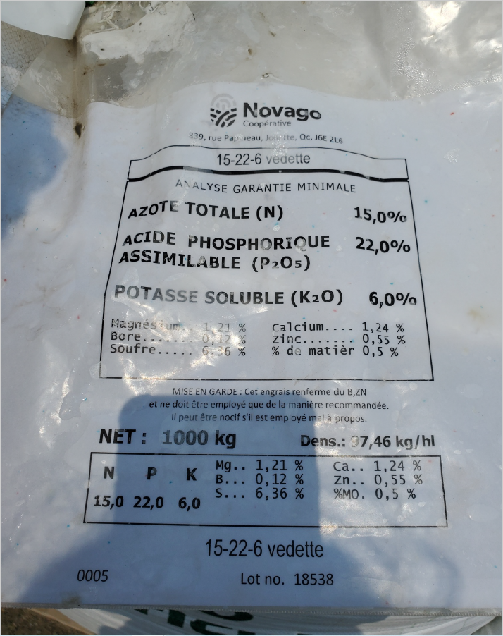

# Observe: label_003

## Images



## Extraction

### Result

```json
{
  "brand_name": {
    "en": "Novago",
    "fr": null
  },
  "product_name": {
    "en": null,
    "fr": "15-22-6 vedette"
  },
  "contacts": [
    {
      "type": "manufacturer",
      "name": "Novago Coopérative",
      "address": "939, rue Papineau, Joliette, QC, J6E 2L6",
      "phone": null,
      "email": null,
      "website": null
    }
  ],
  "registration_number": null,
  "registration_claim": null,
  "lot_number": "18538",
  "net_weight": "1000 kg",
  "volume": "97.46 L",
  "exemption_claim": null,
  "country_of_origin": null,
  "product_classification": null,
  "customer_formula_statements": null,
  "intended_use_statements": null,
  "processing_instruction_statements": null,
  "experimental_statements": null,
  "export_statements": null,
  "n": "15",
  "p": "22",
  "k": "6",
  "ingredients": null,
  "guaranteed_analysis": {
    "title": {
      "en": null,
      "fr": "ANALYSE GARANTIE MINIMALE"
    },
    "is_minimum": true,
    "nutrients": [
      {
        "name": {
          "en": null,
          "fr": "AZOTE TOTALE (N)"
        },
        "value": "15",
        "unit": "%"
      },
      {
        "name": {
          "en": null,
          "fr": "ACIDE PHOSPHORIQUE ASSIMILABLE (P₂O₅)"
        },
        "value": "22",
        "unit": "%"
      },
      {
        "name": {
          "en": null,
          "fr": "POTASSE SOLUBLE (K₂O)"
        },
        "value": "6",
        "unit": "%"
      },
      {
        "name": {
          "en": null,
          "fr": "Magnésium"
        },
        "value": "1.21",
        "unit": "%"
      },
      {
        "name": {
          "en": null,
          "fr": "Calcium"
        },
        "value": "1.24",
        "unit": "%"
      },
      {
        "name": {
          "en": null,
          "fr": "Bore"
        },
        "value": "0.12",
        "unit": "%"
      },
      {
        "name": {
          "en": null,
          "fr": "Zinc"
        },
        "value": "0.55",
        "unit": "%"
      },
      {
        "name": {
          "en": null,
          "fr": "Soufre"
        },
        "value": "6.36",
        "unit": "%"
      },
      {
        "name": {
          "en": null,
          "fr": "% de matière"
        },
        "value": "0.5",
        "unit": "%"
      }
    ]
  },
  "precaution_statements": null,
  "directions_for_use_statements": null
}
```

### Usage: prompt_tokens=8598 completion_tokens=656 total=9254 elapsed=12.4s
