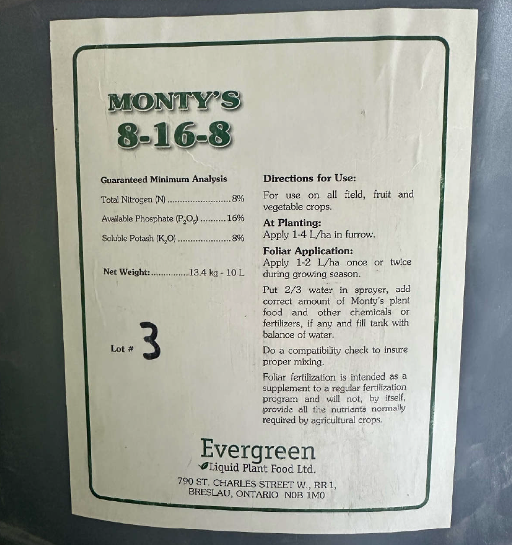

# Observe: label_004

## Images



## Extraction

### Result

```json
{
  "brand_name": {
    "en": "Monty's",
    "fr": null
  },
  "product_name": {
    "en": "8-16-8",
    "fr": null
  },
  "contacts": [
    {
      "type": "manufacturer",
      "name": "Evergreen Liquid Plant Food Ltd.",
      "address": "790 St. Charles Street W., RR1, Breslau, Ontario N0B 1M0",
      "phone": null,
      "email": null,
      "website": null
    }
  ],
  "registration_number": null,
  "registration_claim": null,
  "lot_number": "3",
  "net_weight": "13.4 kg",
  "volume": "10 L",
  "exemption_claim": null,
  "country_of_origin": null,
  "product_classification": null,
  "customer_formula_statements": null,
  "intended_use_statements": null,
  "processing_instruction_statements": null,
  "experimental_statements": null,
  "export_statements": null,
  "n": null,
  "p": null,
  "k": null,
  "ingredients": null,
  "guaranteed_analysis": {
    "title": {
      "en": "Guaranteed Minimum Analysis",
      "fr": null
    },
    "is_minimum": true,
    "nutrients": [
      {
        "name": {
          "en": "Total Nitrogen (N)",
          "fr": null
        },
        "value": "8",
        "unit": "%"
      },
      {
        "name": {
          "en": "Available Phosphate (P2O5)",
          "fr": null
        },
        "value": "16",
        "unit": "%"
      },
      {
        "name": {
          "en": "Soluble Potash (K2O)",
          "fr": null
        },
        "value": "8",
        "unit": "%"
      }
    ]
  },
  "precaution_statements": null,
  "directions_for_use_statements": [
    {
      "en": "For use on all field, fruit and vegetable crops.",
      "fr": null
    },
    {
      "en": "At Planting: Apply 1-4 L/ha in furrow.",
      "fr": null
    },
    {
      "en": "Foliar Application: Apply 1-2 L/ha once or twice during growing season.",
      "fr": null
    },
    {
      "en": "Put 2/3 water in sprayer, add correct amount of Monty's plant food and other chemicals or fertilizers, if any and fill tank with balance of water.",
      "fr": null
    },
    {
      "en": "Do a compatibility check to insure proper mixing.",
      "fr": null
    },
    {
      "en": "Foliar fertilization is intended as a supplement to a regular fertilization program and will not, by itself, provide all the nutrients normally required by agricultural crops.",
      "fr": null
    }
  ]
}
```

### Usage: prompt_tokens=3015 completion_tokens=322 total=3337 elapsed=5.4s
