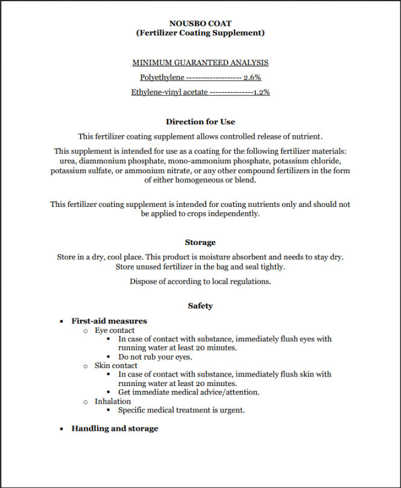
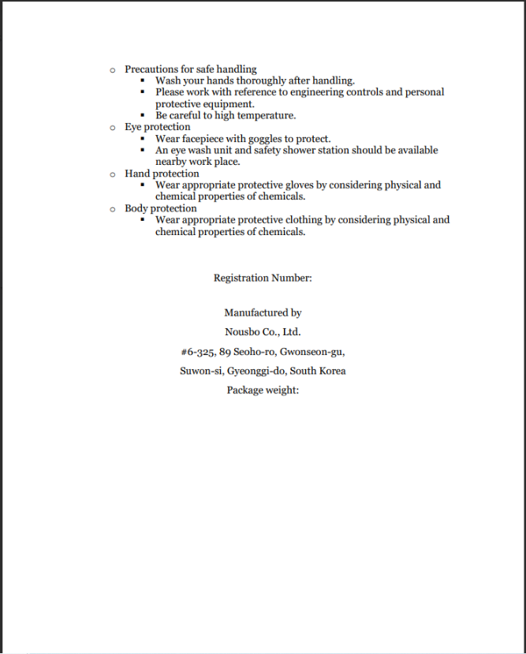
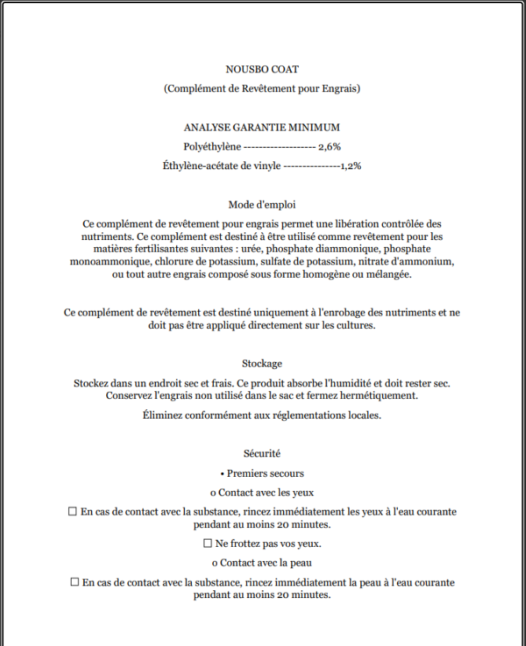
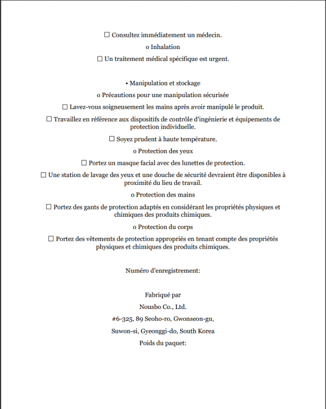

# Observe: label_020

## Images









## Extraction

### Result

```json
{
  "brand_name": {
    "en": "NOUSBO COAT",
    "fr": "NOUSBO COAT"
  },
  "product_name": {
    "en": "Fertilizer Coating Supplement",
    "fr": "Complément de Revêtement pour Engrais"
  },
  "contacts": [
    {
      "type": "manufacturer",
      "name": "Nousbo Co., Ltd.",
      "address": "#6-325, 89 Seoho-ro, Gwonseon-gu, Suwon-si, Gyeonggi-do,
      South Korea",
      "phone": null,
      "email": null,
      "website": null
    }
  ],
  "registration_number": null,
  "registration_claim": null,
  "exemption_claim": {
    "en": "This fertilizer coating supplement allows controlled release of
    nutrient. This supplement is intended for use as a coating for the
     following fertilizer materials: urea, diammonium phosphate, mono-ammonium
      phosphate, potassium chloride, potassium sulfate, or ammonium nitrate, or
       any other compound fertilizers in the form of either homogeneous or blend
       . This fertilizer coating supplement is intended for coating nutrients
       only and should not be applied to crops independently.",
    "fr": "Ce complément de revêtement pour engrais permet une libération
    contrôlée des nutriments. Ce complément est destiné à être utilisé comme
     revêtement pour les matières fertilisantes suivantes : urée, phosphate
      diammonique, phosphate monoammonique, chlorure de potassium, sulfate de
       potassium, nitrate d'ammonium, ou tout autre engrais composé sous forme
        homogène ou mélangée. Ce complément de revêtement est destiné uniquement
         à l'enrobage des nutriments et ne doit pas être appliqué directement
          sur les cultures."
  },
  "lot_number": null,
  "country_of_origin": "South Korea",
  "product_classification": "supplement",
  "net_weight": null,
  "volume": null,
  "n": null,
  "p": null,
  "k": null,
  "guaranteed_analysis": {
    "title": {
      "en": "MINIMUM GUARANTEED ANALYSIS",
      "fr": "ANALYSE GARANTIE MINIMUM"
    },
    "is_minimum": true,
    "nutrients": [
      {
        "name": {
          "en": "Polyethylene",
          "fr": "Polyéthylène"
        },
        "value": "2.6",
        "unit": "%"
      },
      {
        "name": {
          "en": "Ethylene-vinyl acetate",
          "fr": "Éthylène-acétate de vinyle"
        },
        "value": "1.2",
        "unit": "%"
      }
    ]
  },
  "ingredients": null,
  "precaution_statements": null,
  "intended_use_statements": [
    {
      "en": "This fertilizer coating supplement allows controlled release
       of nutrient.",
      "fr": "Ce complément de revêtement pour engrais permet une libération
      contrôlée des nutriments."
    },
    {
      "en": "This supplement is intended for use as a coating for the following
      fertilizer materials: urea, diammonium phosphate, mono-ammonium phosphate,
       potassium chloride, potassium sulfate, or ammonium nitrate, or any other
       compound fertilizers in the form of either homogeneous or blend.",
      "fr": "Ce complément est destiné à être utilisé comme revêtement pour les
       matières fertilisantes suivantes : urée, phosphate diammonique, phosphate
        monoammonique, chlorure de potassium, sulfate de potassium, nitrate
         d'ammonium, ou tout autre engrais composé sous forme homogène ou
         mélangée."
    },
    {
      "en": "This fertilizer coating supplement is intended for coating
      nutrients only and should not be applied to crops independently.",
      "fr": "Ce complément de revêtement est destiné uniquement à l'enrobage
       des nutriments et ne doit pas être appliqué directement sur les cultures."
    }
  ],
  "processing_instruction_statements": null,
  "customer_formula_statements": null,
  "experimental_statements": null,
  "export_statements": null,
  "directions_for_use_statements": [
    {
      "en": "Store in a dry, cool place. This product is moisture absorbent
       and needs to stay dry. Store unused fertilizer in the bag and seal
       tightly.",
      "fr": "Stockez dans un endroit sec et frais. Ce produit absorbe
      l'humidité et doit rester sec. Conservez l'engrais non utilisé dans le
       sac et fermez hermétiquement."
    },
    {
      "en": "Dispose of according to local regulations.",
      "fr": "Éliminez conformément aux réglementations locales."
    },
    {
      "en": "In case of contact with substance, immediately flush eyes with
      running water at least 20 minutes.",
      "fr": "En cas de contact avec la substance, rincez immédiatement les
       yeux à l'eau courante pendant au moins 20 minutes."
    },
    {
      "en": "Do not rub your eyes.",
      "fr": "Ne frottez pas vos yeux."
    },
    {
      "en": "In case of contact with substance, immediately flush skin with
       running water at least 20 minutes.",
      "fr": "En cas de contact avec la substance, rincez immédiatement la
      peau à l'eau courante pendant au moins 20 minutes."
    },
    {
      "en": "Get immediate medical advice/attention.",
      "fr": "Consultez immédiatement un médecin."
    },
    {
      "en": "Specific medical treatment is urgent.",
      "fr": "Un traitement médical spécifique est urgent."
    },
    {
      "en": "Wash your hands thoroughly after handling.",
      "fr": "Lavez-vous soigneusement les mains après avoir manipulé le produit."
    },
    {
      "en": "Please work with reference to engineering controls and personal
      protective equipment.",
      "fr": "Travaillez en référence aux dispositifs de contrôle d'ingénierie
      et équipements de protection individuelle."
    },
    {
      "en": "Be careful to high temperature.",
      "fr": "Soyez prudent à haute température."
    },
    {
      "en": "Wear facepiece with goggles to protect.",
      "fr": "Portez un masque facial avec des lunettes de protection."
    },
    {
      "en": "An eye wash unit and safety shower station should be available
      nearby work place.",
      "fr": "Une station de lavage des yeux et une douche de sécurité devraient
      être disponibles à proximité du lieu de travail."
    },
    {
      "en": "Wear appropriate protective gloves by considering physical and
      chemical properties of chemicals.",
      "fr": "Portez des gants de protection adaptés en considérant les
      propriétés physiques et chimiques des produits chimiques."
    },
    {
      "en": "Wear appropriate protective clothing by considering physical
      and chemical properties of chemicals.",
      "fr": "Portez des vêtements de protection appropriés en tenant compte
       des propriétés physiques et chimiques des produits chimiques."
    }
  ]
}
```

### Call 1 usage: prompt_tokens=3583 completion_tokens=94 total=3677 | elapsed=3.89s

### Call 2 usage: prompt_tokens=3325 completion_tokens=230 total=3555 | elapsed=5.58s

### Call 3 usage: prompt_tokens=3814 completion_tokens=106 total=3920 | elapsed=16.38s

### Call 4 usage: prompt_tokens=3658 completion_tokens=727 total=4385 | elapsed=12.92s

### Total elapsed: 16.6s
