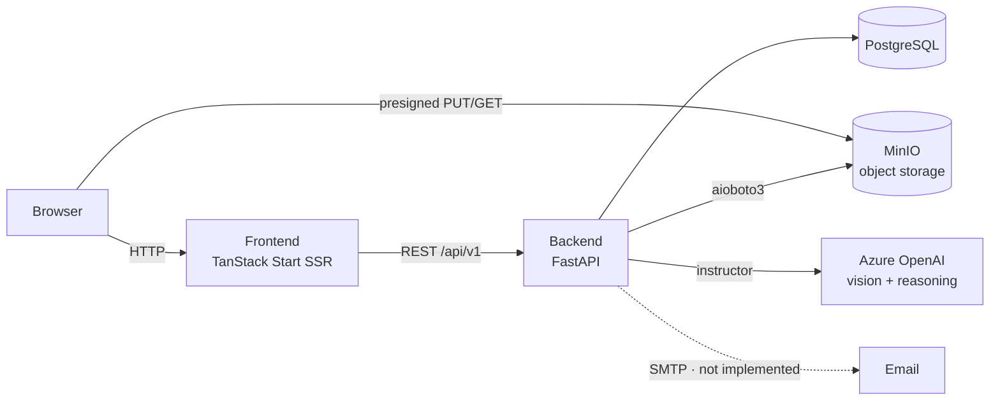

# FertiScan System Architecture

FertiScan analyzes fertilizer labels: users upload label images, an LLM extracts
the label's fields into a structured form, users review and correct the form,
and an LLM-based evaluator checks the label against regulatory requirements.

FertiScan is a prototype under active development (see
[Project status and directions](../README.md#project-status-and-directions)
in the README); expect the architecture to evolve.

## Components



- **Frontend** (`frontend/`) — TanStack Start (SSR React 19) on Vite + Nitro.
  The browser never calls the backend directly: all API calls go through
  TanStack Start **server functions** (`frontend/src/server/*`), which hold the
  auth token in an encrypted httpOnly cookie session and call the backend with
  a generated OpenAPI client. This is a consequence of the hosting
  environment: only the frontend is reachable from the user's browser, so the
  frontend server acts as the API's client on the browser's behalf — with the
  side benefit that the auth token never reaches the browser.
- **Backend** (`backend/`) — FastAPI app serving a versioned REST API at
  `/api/v1`, plus `/healthz` and `/readyz` at the root.
- **Database** — PostgreSQL 18, accessed synchronously via SQLModel/SQLAlchemy
  (`postgresql+psycopg`); schema managed by Alembic.
- **Object storage** — MinIO (S3-compatible) holds label images at
  `labels/{label_id}/{uuid}.{ext}`. Clients upload/download via presigned URLs;
  the backend uses `aioboto3`.
- **LLM** — Azure OpenAI via the `instructor` library, used for both field
  extraction (vision) and compliance evaluation. Configured by
  `AZURE_OPENAI_*` settings; the API returns 503 if unconfigured.
  There is **no separate OCR service**: images go straight to the vision LLM.
- **Email** — **not implemented.** Scaffolding for new-account and
  password-reset emails exists (`app/emails.py`, aiosmtplib) but no SMTP
  service is configured for the prototype; sending is silently skipped.
  Email/account flows are expected to come with the planned external identity
  provider.

## Backend layering

`backend/app/` follows routes → dependencies → controllers → services/storage →
db models, with Pydantic schemas as the wire contract:

| Layer | Path | Role |
| --- | --- | --- |
| Routes | `app/routes/` | Thin FastAPI handlers, no business logic |
| Dependencies | `app/dependencies/` | `Depends()` layer: auth, DB session, S3 client, LLM client, resource resolution (404/403), pagination |
| Controllers | `app/controllers/` | Orchestration and persistence logic |
| Services | `app/services/` | External-effect logic: `extraction.py` (LLM vision extraction), `compliance.py` (prompt build + LLM evaluation) |
| Schemas | `app/schemas/` | Pydantic request/response and LLM response models |
| DB | `app/db/` | SQLModel models, session, seeding (`init_db.py`) |
| Storage | `app/storage/` | MinIO/S3 operations, presigned URLs, path helpers |

Entry point: `backend/app/main.py` — builds the app, CORS, exception handlers
for SQLAlchemy and botocore errors, router registration, pagination.
Startup sequence (`backend/scripts/prestart.sh`): wait for DB → `alembic
upgrade head` → seed (`app/db/init_db.py`) → bootstrap storage bucket
(`app/storage/init.py`).

### Routers

All under `/api/v1` (`app/routes/__init__.py`), except health:

- `health.py` — `GET /healthz`, `GET /readyz`
- `login.py` — OAuth2 token, password recovery/reset
- `users.py` — user CRUD, `/users/me`
- `private.py` — dev/testing-only user creation (mounted only when
  `ENVIRONMENT` is `local` or `testing`)
- `products.py`, `product_types` — product catalog
- `legislation.py`, `requirement.py` — compliance knowledge base (read)
- `labels/` — label CRUD, images (presigned upload/download flow), label data,
  fertilizer label data, extraction, non-compliance items

### Database models

SQLModel models in `app/db/models/`. `Label` is the hub, with cascade-delete
relationships to `LabelImage`, `LabelData`, `FertilizerLabelData`, and
`NonComplianceDataItem`, plus FKs to `Product`, `ProductType`, and `User`.
Per-field provenance/review state lives in `LabelDataFieldMeta` and
`FertilizerLabelDataMeta`.

The compliance knowledge base is a curated relational graph: `Legislation` →
`Provision` → `Requirement` (via `RequirementProvision`), with `Definition`,
`ProvisionDefinition`, and typed `RequirementModifier` rows (exemptions,
applicability conditions). It is seeded from JSON files in
`COMPLIANCE_SEED_DATA_DIR` by `init_db.py` (idempotent upserts). See
[docs/erd.md](erd.md) and [docs/compliance/](compliance/) for details.

Note: DB access is **synchronous** (psycopg + `sessionmaker`); only storage
(aioboto3) and LLM (AsyncAzureOpenAI) calls are async.

## Frontend architecture

- **Routing** — file-based (`frontend/src/routes/`): public auth pages, then an
  authed `_layout/$productType/` tree (dashboard, labels list/new/detail with
  `edit`, `compliance`, `files` children, products, admin, settings).
- **Server-function boundary** — `frontend/src/server/*` contains all backend
  calls (`createServerFn`). `api-client.ts` builds the generated axios client
  (`frontend/src/api`, regenerated from the backend OpenAPI spec via
  `@hey-api/openapi-ts`; `make generate-openapi-client`) with `API_URL` from
  server-side env.
- **Auth** — OAuth2 password grant against the backend; the JWT is stored only
  in an encrypted httpOnly cookie session (`src/server/session.ts`,
  `SESSION_SECRET`). Route guards in `src/server/layout-guard.ts`.
- **State** — React Query for server state (hooks in `src/hooks/`), Zustand
  stores in `src/stores/` for UI state.
- **UI / i18n** — MUI + Tailwind; i18next with `en`/`fr` namespaces
  (`src/i18n/`, `src/locales/`).

## Main data flow: label upload → extraction → structured form

1. **Create label** — `POST /api/v1/labels`.
2. **Register image** — `POST /labels/{id}/images` creates a `LabelImage` row
   with `UploadStatus.pending` (enforcing `MAX_IMAGES_PER_LABEL`).
3. **Upload bytes** — client fetches a presigned upload URL
   (`GET .../presigned-upload-url`) and PUTs the file directly to MinIO.
4. **Complete upload** — the complete-upload endpoint verifies the object
   exists in storage and flips the row to `UploadStatus.completed`.
5. **Extract** — `POST /labels/{id}/fertilizer-extract`
   (`controllers/labels/label_data_extraction.py`): downloads all completed
   images from storage, base64-encodes them into one multimodal message
   (capped at 10 images), and calls Azure OpenAI through `instructor`
   (`services/extraction.py`) with `ExtractFertilizerFieldsOutput` as the
   response model — optionally narrowed to a subset of requested fields.
6. **Review & save** — the frontend edit page (`labels/$labelId/edit.tsx`)
   renders the structured form; partial saves go to `/labels/{id}/data` and
   `/labels/{id}/fertilizer-data`, with per-field review toggling via the
   `*/meta` endpoints.

## Compliance evaluation flow

`GET /labels/{id}/evaluate-non-compliance/{requirement_id}` →
`services/compliance.py`: assembles a context (requirement, provisions,
exemptions, applicability conditions, definitions, and the label's data as
JSON), renders the Jinja prompt template
(`compliance_verification.md` in `PROMPT_TEMPLATES_DIR`), and asks the LLM for
a structured `ComplianceResult`. Verdicts are persisted as
`NonComplianceDataItem` rows and managed from the label's compliance page.
See [docs/compliance/](compliance/) for prompt engineering, interpretation
logic, and known limitations.

## Key decisions and conventions

- **Thin controllers/routes** — HTTP handling in routes, orchestration in
  controllers, external effects in services; Pydantic for API validation,
  SQLModel for persistence.
- **Structured LLM output** — all LLM calls go through `instructor` with
  Pydantic response models, so extraction and compliance results are validated
  at the boundary.
- **Curated compliance knowledge base** — regulatory knowledge is a manually
  curated provision/requirement graph in Postgres (not retrieval over chunked
  legislation), giving per-requirement provenance.
- **Presigned-URL uploads** — image bytes never pass through the backend.
- **Server-function boundary in the frontend** — the browser holds no token
  and never talks to FastAPI; SSR server functions do, using a client
  generated from the backend's OpenAPI spec (single source of truth).
- **Auth** — local password-based JWT auth (OAuth2 password flow) for
  development; an external identity provider is planned for production.
- **Environments** — `ENVIRONMENT` ∈ `local | staging | testing | production`
  gates dev-only routes, secret enforcement, and storage URL scheme.

## Running locally

Prerequisites and setup: see [DEVELOPMENT.md](../DEVELOPMENT.md).

Everything via Docker Compose from the repo root:

```bash
make docker-watch
```

This starts PostgreSQL (5432), MinIO (9000, console 9001), a one-shot
`prestart` container (migrations + seed + bucket), the backend
(http://localhost:8000, docs at `/docs`), the frontend
(http://localhost:5173), and pgAdmin (5050). Env files: `backend/.env` and
`frontend/.env` (copy from the respective `.env.example`).

Running pieces natively:

```bash
cd backend && uv sync && uv run fastapi dev app/main.py --port 5000
```

```bash
cd frontend && npm install && npm run dev
```

Backend tests: `make backend-test` (pytest; SQLite in-memory by default,
real Postgres with `ENVIRONMENT=testing` — see
[backend/TESTING.md](../backend/TESTING.md)). Frontend: `npm run test`
(Vitest) and Playwright E2E in `frontend/tests/`.

## Deployment

Deployment is not in this repo. The preview environment — the current
prototype — is deployed to an
on-prem Kubernetes cluster via Argo CD (GitOps), from the
[howard-on-prem](https://github.com/ai-cfia/howard-on-prem) repository
(`apps/fertiscan/`). Key points:

- Images are published to GHCR (`fertiscan-backend`, `fertiscan-frontend`)
  and tracked from `main`.
- PostgreSQL runs in-cluster (CloudNativePG); configuration and secrets are
  managed on the cluster side.

## Further reading

- [DEVELOPMENT.md](../DEVELOPMENT.md) — environment setup
- [docs/erd.md](erd.md) — entity-relationship diagram
- [docs/compliance/](compliance/) — compliance evaluation design docs
- [backend/README.md](../backend/README.md), [frontend/README.md](../frontend/README.md)
