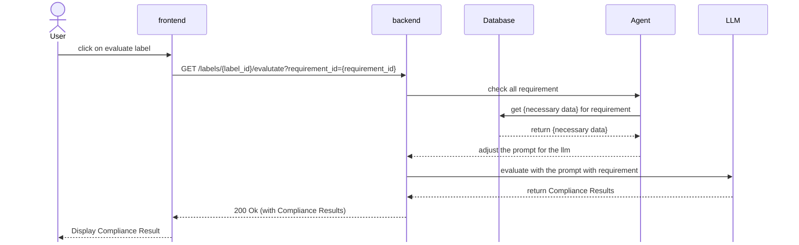
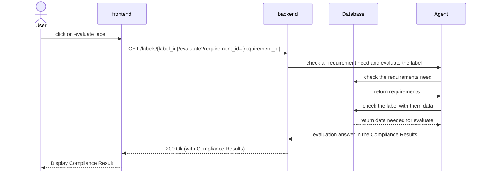

# Design Azure Agent

## Adjust prompt only

```mermaid
%%{init: { "sequence": { "mirrorActors": false } }}%%
sequenceDiagram

actor us as User
participant fe as frontend
participant be as backend
participant db as Database
participant ag as Agent
participant llm as LLM

us ->> fe : click on evaluate label
fe ->> be : GET /labels/{label_id}/evalutate?requirement_id={requirement_id}
be ->> ag : check all requirement
ag ->> db : get {necessary data} for requirement
db -->> ag : return {necessary data}
ag -->> be : adjust the prompt for the llm
be ->> llm : evaluate with the prompt with requirement
llm -->> be : return Compliance Results
be -->> fe : 200 Ok (with Compliance Results)
fe -->> us : Display Compliance Result
```

## Search and evaluate self

```mermaid
%%{init: { "sequence": { "mirrorActors": false } }}%%
sequenceDiagram

actor us as User
participant fe as frontend
participant be as backend
participant db as Database
participant ag as Agent

us ->> fe : click on evaluate label
fe ->> be : GET /labels/{label_id}/evalutate?requirement_id={requirement_id}
be ->> ag : check all requirement need and evaluate the label
ag ->> db : check the requirements need
db -->> ag : return requirements
ag ->> db : check the label with them data
db -->> ag: return data needed for evaluate
ag -->> be : evaluation answer in the Compliance Results
be -->> fe : 200 Ok (with Compliance Results)
fe -->> us : Display Compliance Result
```
