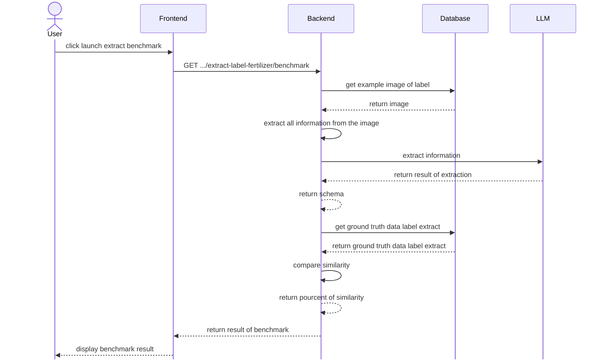
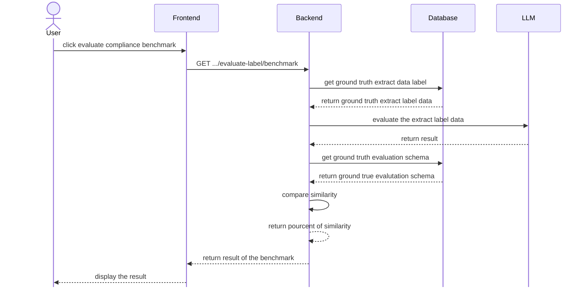
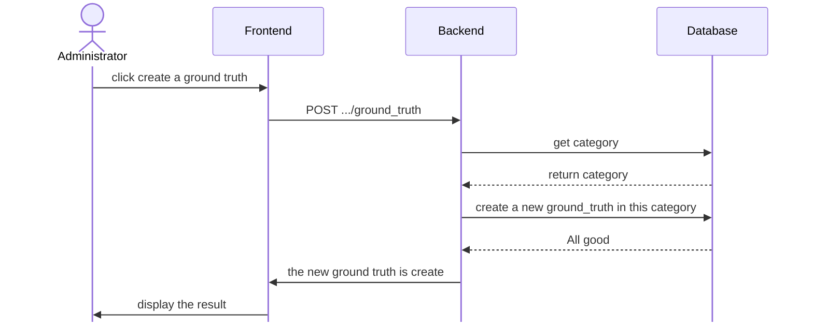

# Design for benchmark the system

## Extract design

```mermaid
%%{init: { "sequence": { "mirrorActors": false } }}%%
sequenceDiagram

actor us as User
participant fe as Frontend
participant be as Backend
participant db as Database
participant ai as LLM

us ->> fe : click launch extract benchmark
fe ->> be : GET .../extract-label-fertilizer/benchmark
be ->> db: get example image of label
db -->> be : return image
be ->> be : extract all information from the image
be ->> ai : extract information
ai -->> be : return result of extraction
be -->> be : return schema
be ->> db : get ground truth data label extract
db -->> be: return ground truth data label extract
be ->> be : compare similarity
be -->> be : return pourcent of similarity
be -->> fe : return result of benchmark
fe -->> us : display benchmark result

```

## Compliance design

```mermaid
%%{init: { "sequence": { "mirrorActors": false } }}%%
sequenceDiagram

actor us as User
participant fe as Frontend
participant be as Backend
participant db as Database
participant ai as LLM

us ->> fe : click evaluate compliance benchmark
fe ->> be : GET .../evaluate-label/benchmark
be ->> db : get ground truth extract data label
db -->> be: return ground truth extract label data
be ->> ai : evaluate the extract label data
ai -->> be : return result
be ->> db : get ground truth evaluation schema
db -->> be : return ground true evalutation schema
be ->> be : compare similarity
be -->> be : return pourcent of similarity
be -->> fe : return result of the benchmark
fe -->> us : display the result

```

## Ground truth general

### Design of ground truth

```mermaid
%%{init: { "sequence": { "mirrorActors": false } }}%%
sequenceDiagram

actor us as Administrator
participant fe as Frontend
participant be as Backend
participant db as Database

us ->> fe : click create a ground truth
fe ->> be : POST .../ground_truth
be ->> db : get category
db -->> be : return category
be ->> db : create a new ground_truth in this category
db -->> be : All good
be ->> fe: the new ground truth is create
fe ->> us : display the result


```
