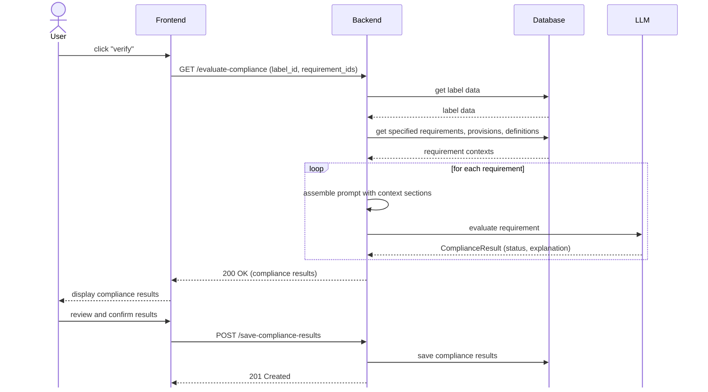

# Compliance Evaluation

```mermaid
%%{init: { "sequence": { "mirrorActors": false } }}%%
sequenceDiagram
    actor usr as User
    participant fe as Frontend
    participant be as Backend
    participant db as Database
    participant llm as LLM

    usr ->> fe : click "verify"
    fe ->> be : GET /evaluate-compliance (label_id, requirement_ids)

    be ->> db : get label data
    db -->> be : label data

    be ->> db : get specified requirements, provisions, definitions
    db -->> be : requirement contexts

    loop for each requirement
        be ->> be : assemble prompt with context sections
        be ->> llm : evaluate requirement
        llm -->> be : ComplianceResult (status, explanation)
    end

    be -->> fe : 200 OK (compliance results)

    fe -->> usr : display compliance results

    usr ->> fe : review and confirm results
    fe ->> be : POST /save-compliance-results
    be ->> db : save compliance results
    be -->> fe : 201 Created
```
