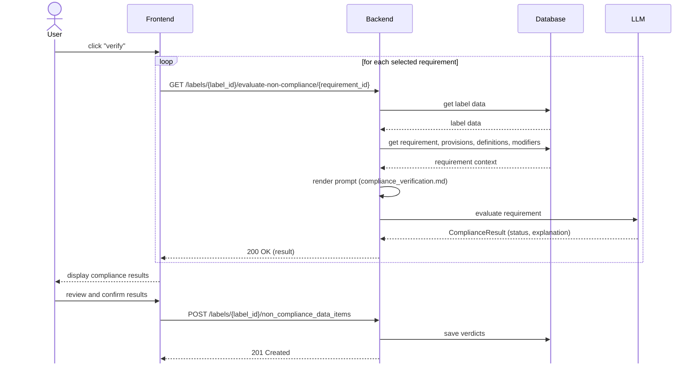

# Compliance Evaluation

Evaluation is per requirement: the frontend loops over the selected
requirements, calling the backend once per requirement. Confirmed results are
saved as `NonComplianceDataItem` rows (one per label/requirement pair).

