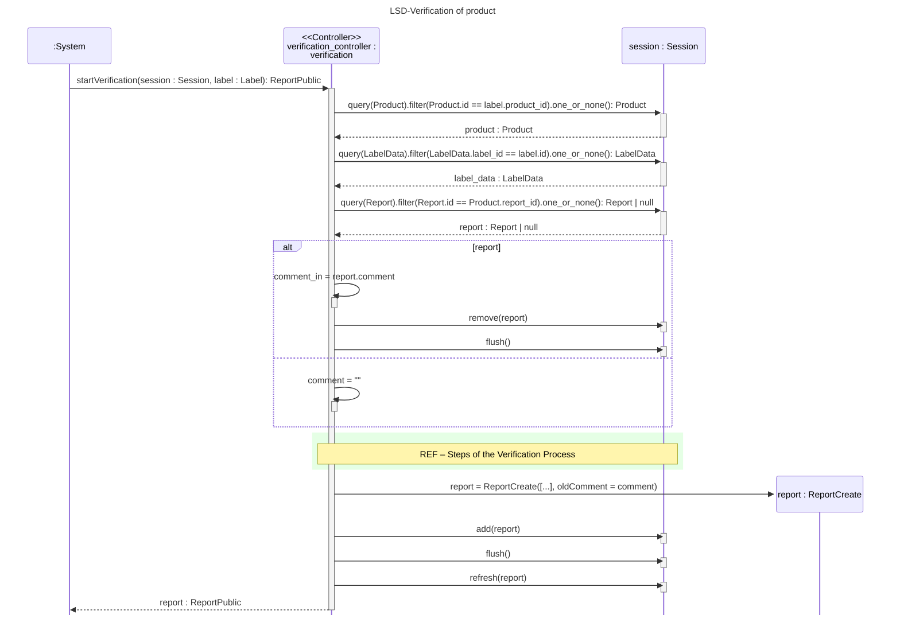

# General Design of verification

```mermaid
%%{init: { "sequence": { "mirrorActors": false } }}%%
sequenceDiagram
    title LSD-Verification of product

    participant sys as :System
    participant ver as <<Controller>><br>verification_controller : <br> verification
    participant db as session : Session


    sys ->>+ ver : startVerification(session : Session, label : Label): ReportPublic

    ver ->>+ db : query(Product).filter(Product.id == label.product_id).one_or_none(): Product

    db -->>- ver : product : Product

    ver ->>+ db : query(LabelData).filter(LabelData.label_id == label.id).one_or_none(): LabelData

    db -->>- ver: label_data : LabelData

    ver ->>+ db: query(Report).filter(Report.id == Product.report_id).one_or_none(): Report | null

    db -->>- ver: report : Report | null

    alt report
        ver ->> ver: comment_in = report.comment
        activate ver
        deactivate ver

        ver ->> db : remove(report)
        activate db
        deactivate db

        ver ->> db : flush()
        activate db
        deactivate db

    else
        ver ->> ver: comment = ""
        activate ver
        deactivate ver

    end


    rect rgba(0,250,0,0.1)
        note over ver,db: REF – Steps of the Verification Process
    end


    create participant sch as report : ReportCreate
    ver ->> sch: report = ReportCreate([...], oldComment = comment)

    ver ->> db: add(report)
    activate db
    deactivate db

    ver ->> db: flush()
    activate db
    deactivate db

    ver ->> db: refresh(report)
    activate db
    deactivate db

    ver -->>-sys: report : ReportPublic

```
