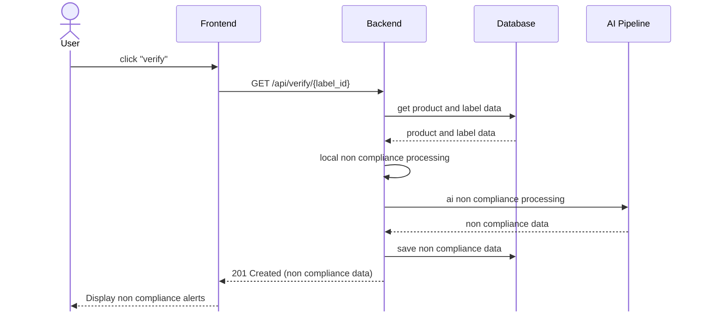
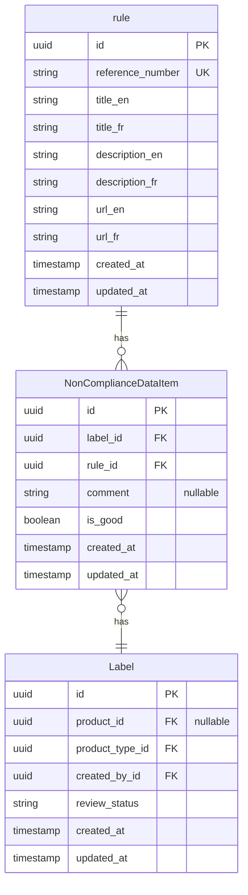

# General Design

## Local verification

```mermaid
%%{init: { "sequence": { "mirrorActors": false } }}%%
sequenceDiagram
    actor usr as User
    participant fe as Frontend
    participant be as Backend
    participant db as Database
    participant ai as AI Pipeline

    usr ->> fe : click "verify"
    fe ->> be : GET /api/verify/{label_id}

    be ->> db : get product and label data
    db -->> be : product and label data

    be ->> be : local non compliance processing
    be ->> ai : ai non compliance processing
    ai -->> be : non compliance data

    be ->> db : save non compliance data

    be -->> fe: 201 Created (non compliance data)

    fe -->> usr: Display non compliance alerts
```

## ERD

```mermaid
erDiagram


    NonComplianceDataItem }o--|| Label:"has"
    rule ||--o{ NonComplianceDataItem:"has"
    rule{
        uuid id PK
        string reference_number UK
        string title_en
        string title_fr
        string description_en
        string description_fr
        string url_en
        string url_fr
        timestamp created_at
        timestamp updated_at
    }

    NonComplianceDataItem{
        uuid id PK
        uuid label_id FK
        uuid rule_id FK
        string comment "nullable"
        boolean is_good
        timestamp created_at
        timestamp updated_at

    }


    Label {
        uuid id PK
        uuid product_id FK "nullable"
        uuid product_type_id FK
        uuid created_by_id FK
        string review_status
        timestamp created_at
        timestamp updated_at
    }


```
