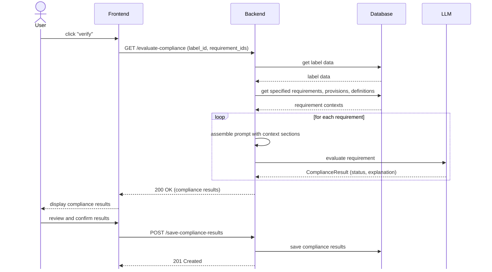
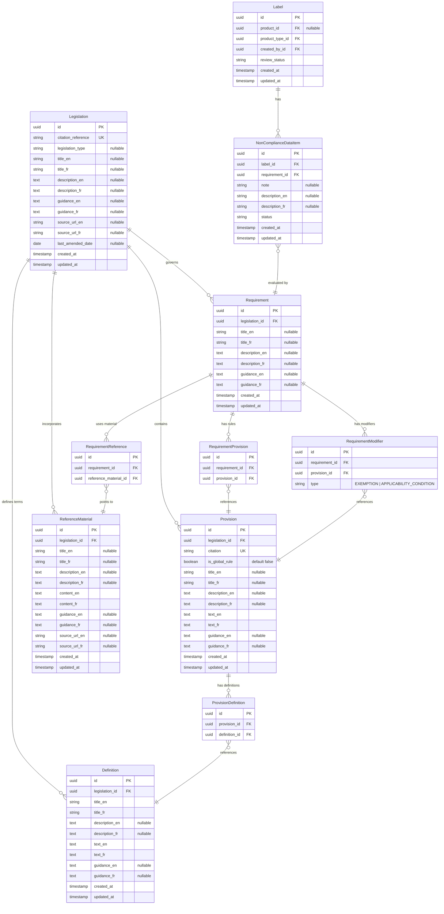

# General Design

## Compliance Evaluation



## ERD



## LLM Response Format

The LLM response is parsed into a structured `ComplianceResult`:

```python
class ComplianceStatus(str, Enum):
    COMPLIANT = "compliant"
    NON_COMPLIANT = "non_compliant"
    NOT_APPLICABLE = "not_applicable"
    INCONCLUSIVE = "inconclusive"

class ComplianceResult(BaseModel):
    status: ComplianceStatus = Field(
        ...,
        description="Outcome of the check. COMPLIANT, NON_COMPLIANT, NOT_APPLICABLE, or INCONCLUSIVE (requires human review)."
    )
    explanation_en: str = Field(
        ...,
        description="Step-by-step reasoning citing specific evidence from the Label Data that supports or contradicts the regulation's requirements. in English",
    )
    explanation_fr: str = Field(
        ...,
        description="Step-by-step reasoning citing specific evidence from the Label Data that supports or contradicts the regulation's requirements. in French",
    )
```

- `COMPLIANT` (`compliant`) — The label satisfies the requirement.
- `NON_COMPLIANT` (`non_compliant`) — The label violates the requirement.
- `NOT_APPLICABLE` (`not_applicable`) — An exemption or applicability condition
  short-circuited the evaluation.
- `INCONCLUSIVE` (`inconclusive`) — The provided data is insufficient,
  ambiguous, or contradicts the requirement in a way that prevents a clear
  determination. Requires human review.

## Prompt Engineering

The compliance prompt template `compliance_verification.md` injects separated
context sections built from the `Requirement` hub. The template follows this
structure:

````markdown
# Compliance Verification

## Role

You are a Regulatory Compliance Engine. Your sole purpose is to verify if a
product's label data adheres to a specific regulatory requirement.

## Verification Protocol

1. Consult the **Dictionary** and **Reference Materials** to establish the strict
   legal definitions of terms and supplementary standards used in the subsequent texts.
2. Evaluate the **Global Exemptions**. If the product is globally exempt or
   fundamentally violates a core prohibition, stop and return the overarching
   result.
3. Evaluate the **Exemptions**. If any exemption applies to the product,
   stop and return "Not Applicable" for this check.
4. Evaluate the **Applicability Conditions**. If any condition is not met,
   stop and return "Not Applicable" for this check.
5. Evaluate compliance exclusively against the **Rules**.

## Constraints

- Do not assume the presence of data not explicitly provided in the Label Data.
- Base your decision solely on the provided legal texts and data.
- Support your conclusion with specific evidence from the Label Data.
- Apply definitions from the Dictionary and standards from Reference Materials strictly — do not use colloquial interpretations of legal terms.
- Inconclusive by default: If the provided context and label data are insufficient to reach a definitive conclusion (COMPLIANT, NON_COMPLIANT, or NOT_APPLICABLE), you must return INCONCLUSIVE.

## Reference Materials

```text
{{ reference_materials }}
```

## Dictionary

```text
{{ dictionary }}
```

## Global Exemptions

```text
{{ global_exemptions }}
```

## Exemptions

```text
{{ exemptions }}
```

## Applicability Conditions

```text
{{ applicability_conditions }}
```

## Rules

```text
{{ rules }}
```

## Label Data

```json
{{ label_data }}
```
````

## Considered Alternatives

- **Knowledge Graph:** The current relational model acts as a manually curated
  graph. To explore later.
- **RAG:** Skipped to prioritize precision for safety-critical checks. To
  explore later.

## Known Limitations & Future Improvements

- **Performance & Cost:** Currently, all `Requirements` are evaluated
  individually by the LLM (to check applicability/modifiers), including global
  rules which are re-injected into every prompt rather than evaluated once. In a
  document with hundreds of requirements, this will be expensive and slow.
- **Versioning:** The model is currently snapshot-based; it represents the most
  recent version of the legislation. Implementing historical versioning for past
  laws is a future milestone.
- **Label Data Filtering:** The full label data JSON is injected into every
  requirement prompt. Scoping this to relevant data points (e.g. only injecting
  `ingredients` for 16(7)) would improve token efficiency.
- **Missing Registry Verification Skill:** The system currently cannot verify
  the authenticity or status of registration numbers against a live CFIA
  database (Section 16(1)(c)). These checks currently result in `INCONCLUSIVE`
  for human review.
- **Missing Component Validation Skill:** There is no automated capability yet
  to validate ingredients against the specific definitions and guidelines in
  the **List of Materials** (Section 16(1)(k)). Since these entries contain
  complex safety standards and criteria for regulatory decisions, the LLM
  identifies candidate terms but relies on `INCONCLUSIVE` flags for terminal
  human verification.

## LLM Interpretation Logic

This section defines the mandatory interpretation logic the LLM must follow to
reconcile legal provisions with label data. It ensures that every evaluation
follows a predictable flow and prioritizes safety by flagging ambiguity for
human review.

### Global Interpretation Logic

These overarching checks apply fundamentally to whether the Fertilizers
Act/Regulations apply at all to the product. If these conditions are met, all
specific requirement checks are terminated.

| Legal Trigger | Check (Logic & Data Consistency) | Data Needed from Label                                                               | Required Context                                | Result               |
| :------------ | :------------------------------- | :----------------------------------------------------------------------------------- | :---------------------------------------------- | :------------------- |
| `Sec 3(1)(a)` | Is product **natural manure**?   | Product name, ingredients                                                            | `3(1)(a)`, `fertilizer`, `supplement`           | **`NOT_APPLICABLE`** |
| `Sec 3(1)(b)` | For **manufacturing only**?      | Intended use statements, processing instructions, address, country of origin         | `3(1)(b)`, `fertilizer`, `supplement`           | **`NOT_APPLICABLE`** |
| `Sec 3(1.1)`  | For **export only**?             | Export intent or destination statements                                              | `3(1.1)`, `fertilizer`, `supplement`            | **`NOT_APPLICABLE`** |
| `Sec 3(2)`    | **Experimental supplement**?     | Research intent, permit num                                                          | `3(2)`, `supplement`                            | **`NOT_APPLICABLE`** |
| `Sec 3(3)`    | **Experimental fertilizer**?     | Research intent, ingredients (exclude supplements/pesticides), disposal instructions | `3(3)`, `fertilizer`, `supplement`, `pesticide` | **`NOT_APPLICABLE`** |

### Requirement Implementation: Manufacturer Name and Address (16(1)(a))

| Legal Trigger      | Check (Logic & Data Consistency)                                                                        | Data Needed from Label                                        | Required Context                                    | Result               |
| :----------------- | :------------------------------------------------------------------------------------------------------ | :------------------------------------------------------------ | :-------------------------------------------------- | :------------------- |
| `Section 16(1)`    | Is product a **customer formula fertilizer**? (Explicitly excluded by 16(1) preamble)                   | Intended user, product classification                         | Definition: `customer formula fertilizer`           | **`NOT_APPLICABLE`** |
| `Section 16(7)`    | Does label consist only of simple, inert materials (Peat, Perlite, etc.)? (Handled by 16(7)(b) instead) | Ingredients                                                   | Provision: `16(7)`, Definition: `List of Materials` | **`NOT_APPLICABLE`** |
| `Section 16(1)(a)` | Is there a **name** AND an **address** (of manufacturer, registrant, or packager) on the label?         | Accountable entity identification, Entity role, Intended user | Provision: `16(1)(a)`                               | **`COMPLIANT`**      |
| `Section 16(1)(a)` | Is a name present but the **address is missing**, or vice-versa?                                        | Accountable entity identification, Entity role, Intended user | Provision: `16(1)(a)`                               | **`NON_COMPLIANT`**  |
| `Section 16(1)(a)` | Is both the **name and address completely missing** from the label?                                     | Accountable entity identification, Entity role, Intended user | Provision: `16(1)(a)`                               | **`NON_COMPLIANT`**  |
| `Section 16(1)(a)` | Is there a name/address that is **incomplete, illegible, or ambiguous**? (Requires human check)         | Accountable entity identification, Entity role, Intended user | Provision: `16(1)(a)`                               | **`INCONCLUSIVE`**   |

### Requirement Implementation: Product Name (16(1)(b))

| Legal Trigger      | Check (Logic & Data Consistency)                                                                        | Data Needed from Label                | Required Context                                    | Result               |
| :----------------- | :------------------------------------------------------------------------------------------------------ | :------------------------------------ | :-------------------------------------------------- | :------------------- |
| `Section 16(1)`    | Is product a **customer formula fertilizer**? (Explicitly excluded by 16(1) preamble)                   | Intended user, product classification | Definition: `customer formula fertilizer`           | **`NOT_APPLICABLE`** |
| `Section 16(7)`    | Does label consist only of simple, inert materials (Peat, Perlite, etc.)? (Handled by 16(7)(c) instead) | Ingredients                           | Provision: `16(7)`, Definition: `List of Materials` | **`NOT_APPLICABLE`** |
| `Section 16(1)(b)` | Is the **name** of the fertilizer or supplement present on the label?                                   | Product name                          | Provision: `16(1)(b)`                               | **`COMPLIANT`**      |
| `Section 16(1)(b)` | Is the **name completely missing** from the label?                                                      | Product name                          | Provision: `16(1)(b)`                               | **`NON_COMPLIANT`**  |
| `Section 16(1)(b)` | Is the name **incomplete, illegible, or ambiguous**? (Requires human check)                             | Product name                          | Provision: `16(1)(b)`                               | **`INCONCLUSIVE`**   |

### Requirement Implementation: Registration Number (16(1)(c))

| Legal Trigger      | Check (Logic & Data Consistency)                                                                         | Data Needed from Label                                    | Required Context                                    | Result               |
| :----------------- | :------------------------------------------------------------------------------------------------------- | :-------------------------------------------------------- | :-------------------------------------------------- | :------------------- |
| `Section 16(1)`    | Is product a **customer formula fertilizer**? (Explicitly excluded by 16(1) preamble)                    | Intended user, product classification                     | Definition: `customer formula fertilizer`           | **`NOT_APPLICABLE`** |
| `Section 16(7)`    | Does label consist only of simple, inert materials (Peat, Perlite, etc.)? (Exempted from subsection (1)) | Ingredients                                               | Provision: `16(7)`, Definition: `List of Materials` | **`NOT_APPLICABLE`** |
| `Section 16(1)(c)` | Is the **registration number** present and explicitly labeled (e.g. "Reg. No.")?                         | Registration number string, Registration claim statements | Provision: `16(1)(c)`                               | **`COMPLIANT`**      |
| `Section 16(1)(c)` | Does label contain a **registration claim** field (e.g. "Reg No") with a missing or blank value?         | Registration number string, Registration claim statements | Provision: `16(1)(c)`                               | **`NON_COMPLIANT`**  |
| `Section 16(1)(c)` | Is registration **ambiguous** (no number found, but no explicit exemption proven)?                       | Registration number string, Registration claim statements | Provision: `16(1)(c)`                               | **`INCONCLUSIVE`**   |
| `Section 16(1)(c)` | Is the registration number **incomplete, illegible, or in an invalid format**? (Requires human check)    | Registration number string                                | Provision: `16(1)(c)`                               | **`INCONCLUSIVE`**   |

> [!NOTE] **Notes**
>
> - The system only looks at the text actually printed on the label. It cannot
>   yet check the official CFIA database to see if a product is registered. If a
>   label doesn't mention a registration number, the system should not assume
>   it's "exempt"—it should flag it as `INCONCLUSIVE` for a human to
>   double-check.
> - **Presence vs. Validity**: A `COMPLIANT` result means a number looks
>   correct, but it does not guarantee the number is authentic or belongs to
>   that product.

### Requirement Implementation: Exempt Mixture Components (16(1)(d))

| Legal Trigger      | Check (Data Presence & Consistency)                                                             | Data Needed from Label                                                               | Required Context                                        | Result               |
| :----------------- | :---------------------------------------------------------------------------------------------- | :----------------------------------------------------------------------------------- | :------------------------------------------------------ | :------------------- |
| `Section 3.1`      | Is product itself registered (has a number) or a customer formula?                              | Main product registration evidence, Intended user                                    | Definition: `customer formula fertilizer`, `registrant` | **`NOT_APPLICABLE`** |
| `Section 16(7)`    | Does label consist only of simple, inert materials (Peat, Perlite, etc.)?                       | Ingredients                                                                          | Provision: `16(7)`, Definition: `List of Materials`     | **`NOT_APPLICABLE`** |
| `Section 18(1)`    | Is the **Section 18 statement** (e.g., "ingredients in this mixture are registered") present?   | Exemption claim statement                                                            | Provision: `18(1)`                                      | **`NOT_APPLICABLE`** |
| `Section 16(1)(d)` | Does every ingredient **explicitly labeled** as registered (e.g., "Reg No") have its number?    | Ingredient list with registration references                                         | Provision: `16(1)(d)`                                   | **`COMPLIANT`**      |
| `Section 16(1)(d)` | Technical ingredient name with **no number** and **no exemption claim**? (Requires human check) | Ingredient list with registration references, Exemption claim statement, Ingredients | Provision: `16(1)(d)`, Definition: `List of Materials`  | **`INCONCLUSIVE`**   |
| `Section 16(1)(d)` | Ingredient explicitly called **"registered"** but has no accompanying registration number?      | Ingredient list with registration references                                         | Provision: `16(1)(d)`                                   | **`NON_COMPLIANT`**  |

### Requirement Implementation: Directions for Use (16(1)(e))

| Legal Trigger      | Check (Logic & Data Consistency)                                                                         | Data Needed from Label                                             | Required Context                                                            | Result               |
| :----------------- | :------------------------------------------------------------------------------------------------------- | :----------------------------------------------------------------- | :-------------------------------------------------------------------------- | :------------------- |
| `Section 16(1)`    | Is product a **customer formula fertilizer**? (Explicitly excluded by 16(1) preamble)                    | Intended user, product classification                              | Definition: `customer formula fertilizer`                                   | **`NOT_APPLICABLE`** |
| `Section 16(7)`    | Does label consist only of simple, inert materials (Peat, Perlite, etc.)? (Exempted from subsection (1)) | Ingredients                                                        | Provision: `16(7)`, Definition: `List of Materials`                         | **`NOT_APPLICABLE`** |
| `Sec 3.1(3)/(4)`   | Is product a **treated seed** or **growing medium** exempt from registration?                            | Product classification                                             | Provisions: `3.1(3)`, `3.1(4)`                                              | **`NOT_APPLICABLE`** |
| `Section 16(1)(e)` | Are **directions for use** present on the label?                                                         | Directions for use                                                 | Provision: `16(1)(e)`                                                       | **`COMPLIANT`**      |
| `Section 16(1)(e)` | Are directions for use **completely missing** from the label?                                            | Directions for use                                                 | Provision: `16(1)(e)`                                                       | **`NON_COMPLIANT`**  |
| `Section 16(1)(e)` | Are the directions **incomplete, illegible, or ambiguous**? (Requires human check)                       | Directions for use                                                 | Provision: `16(1)(e)`                                                       | **`INCONCLUSIVE`**   |
| `Section 16(1)(e)` | Is it unclear if the product is a seed/medium or if registration status allows exemption?                | Product classification, Ingredients, Registration claim statements | Provisions: `16(1)(e)`, `3.1(3)`, `3.1(4)`, Definition: `List of Materials` | **`INCONCLUSIVE`**   |

> [!NOTE] **Notes**
>
> - **Exemption Complexity**: For treated seeds [3.1(3)] and growing media
>   [3.1(4)], the exemption from directions depends on their registration
>   status. If the label doesn't provide enough evidence to confirm this status,
>   flag as `INCONCLUSIVE`.

### Requirement Implementation: Weight (16(1)(f))

| Legal Trigger      | Check (Logic & Data Consistency)                                                                        | Data Needed from Label | Required Context               | Result               |
| :----------------- | :------------------------------------------------------------------------------------------------------ | :--------------------- | :----------------------------- | :------------------- |
| `Section 16(1)`    | Is product a **customer formula fertilizer**? (Explicitly excluded by 16(1) preamble)                   | Intended user          | Definition: `customer formula` | **`NOT_APPLICABLE`** |
| `Section 16(7)`    | Does label consist only of simple, inert materials (Peat, Perlite, etc.)? (Handled by 16(7)(d) instead) | Ingredients            | Provision: `16(7)`             | **`NOT_APPLICABLE`** |
| `Section 16(1)(f)` | Is the **weight** present on the label?                                                                 | Weight                 | Provision: `16(1)(f)`          | **`COMPLIANT`**      |
| `Section 16(1)(f)` | Is the **weight completely missing** from the label?                                                    | Weight                 | Provision: `16(1)(f)`          | **`NON_COMPLIANT`**  |

> [!NOTE] **Notes**
>
> - **Exemption 16(7)**: Section 16(7)(d) allows for volume instead of weight
>   for specific materials (e.g., Peat, Perlite, Moss).

### Requirement Implementation: Guaranteed Analysis (16(1)(g))

| Legal Trigger      | Check (Logic & Data Consistency)                                                                         | Data Needed from Label                | Required Context                                    | Result               |
| :----------------- | :------------------------------------------------------------------------------------------------------- | :------------------------------------ | :-------------------------------------------------- | :------------------- |
| `Section 16(1)`    | Is product a **customer formula fertilizer**? (Explicitly excluded by 16(1) preamble)                    | Intended user, product classification | Definition: `customer formula fertilizer`           | **`NOT_APPLICABLE`** |
| `Section 16(7)`    | Does label consist only of simple, inert materials (Peat, Perlite, etc.)? (Exempted from subsection (1)) | Ingredients                           | Provision: `16(7)`, Definition: `List of Materials` | **`NOT_APPLICABLE`** |
| `Section 16(1)(g)` | Is a **Guaranteed Analysis** block present on the label?                                                 | Guaranteed analysis                   | Provision: `16(1)(g)`                               | **`COMPLIANT`**      |
| `Section 16(1)(g)` | Is the **guaranteed analysis completely missing** from the label?                                        | Guaranteed analysis                   | Provision: `16(1)(g)`                               | **`NON_COMPLIANT`**  |

### Requirement Implementation: Precaution Statement (16(1)(h))

| Legal Trigger      | Check (Logic & Data Consistency)                                                                        | Data Needed from Label                | Required Context                                    | Result               |
| :----------------- | :------------------------------------------------------------------------------------------------------ | :------------------------------------ | :-------------------------------------------------- | :------------------- |
| `Section 16(1)`    | Is product a **customer formula fertilizer**? (Explicitly excluded by 16(1) preamble)                   | Intended user, product classification | Definition: `customer formula fertilizer`           | **`NOT_APPLICABLE`** |
| `Section 16(7)`    | Does label consist only of simple, inert materials (Peat, Perlite, etc.)? (Handled by 16(7)(f) instead) | Ingredients                           | Provision: `16(7)`, Definition: `List of Materials` | **`NOT_APPLICABLE`** |
| `Section 16(1)(h)` | Is a **precaution statement** present (precautions, warnings, safety measures)?                         | Precaution statement                  | Provision: `16(1)(h)`                               | **`COMPLIANT`**      |
| `Section 16(1)(h)` | Is a precaution statement **completely missing** from the label?                                        | Precaution statement                  | Provision: `16(1)(h)`                               | **`NON_COMPLIANT`**  |
| `Section 16(1)(h)` | Is the statement **incomplete, illegible, or ambiguous**? (Requires human check)                        | Precaution statement                  | Provision: `16(1)(h)`                               | **`INCONCLUSIVE`**   |

> [!NOTE] **Notes**
>
> - **Mandatory Presence**: The law requires a statement setting out _any_ necessary precaution. For the purpose of this check, the absence of such a statement is treated as a violation.

### Requirement Implementation: Prohibited Material Statements (16(1)(i))

| Legal Trigger      | Check (Logic & Data Consistency)                                                                         | Data Needed from Label                    | Required Context                                              | Result               |
| :----------------- | :------------------------------------------------------------------------------------------------------- | :---------------------------------------- | :------------------------------------------------------------ | :------------------- |
| `Section 16(1)`    | Is product a **customer formula fertilizer**? (Explicitly excluded by 16(1) preamble)                    | Intended user, product classification     | Definition: `customer formula fertilizer`                     | **`NOT_APPLICABLE`** |
| `Section 16(7)`    | Does label consist only of simple, inert materials (Peat, Perlite, etc.)? (Exempted from subsection (1)) | Ingredients                               | Provision: `16(7)`, Definition: `List of Materials`           | **`NOT_APPLICABLE`** |
| `Section 16(1)(i)` | Is it clear the product does **not** contain prohibited material?                                        | Ingredients, Prohibited material flag     | Provision: `16(1)(i)`, Health of Animals Regulations `162(1)` | **`NOT_APPLICABLE`** |
| `Section 16(1)(i)` | If it contains prohibited material, are **all four** required statements present on the label?           | Precaution statements, Warning statements | Provision: `16(1)(i)`                                         | **`COMPLIANT`**      |
| `Section 16(1)(i)` | If it contains prohibited material, are **any** of the four required statements completely missing?      | Precaution statements, Warning statements | Provision: `16(1)(i)`                                         | **`NON_COMPLIANT`**  |
| `Section 16(1)(i)` | Is it **unclear** (e.g., animal-origin ingredients present but status as "prohibited" is ambiguous)?     | Ingredients, Precaution statements        | Provision: `16(1)(i)`, Health of Animals Regulations `162(1)` | **`INCONCLUSIVE`**   |

> [!NOTE] **Notes**
>
> - **Prohibited Material**: Defined in subsection 162(1) of the _Health of Animals Regulations_. It generally includes protein originated from mammals, with specific exceptions (like porcine, equine, milk, etc.). If the label doesn't specify if an animal product is a prohibited material and it could be, flag as `INCONCLUSIVE`.
> - **Required Statements**: If applicable, the label must contain four specific statements about feeding to ruminants, grazing areas, ingestion, and hand washing. All four must be present to be `COMPLIANT`.

### Requirement Implementation: Lot Number (16(1)(j))

| Legal Trigger      | Check (Logic & Data Consistency)                                                                         | Data Needed from Label                | Required Context                                    | Result               |
| :----------------- | :------------------------------------------------------------------------------------------------------- | :------------------------------------ | :-------------------------------------------------- | :------------------- |
| `Section 16(1)`    | Is product a **customer formula fertilizer**? (Explicitly excluded by 16(1) preamble)                    | Intended user, product classification | Definition: `customer formula fertilizer`           | **`NOT_APPLICABLE`** |
| `Section 16(7)`    | Does label consist only of simple, inert materials (Peat, Perlite, etc.)? (Exempted from subsection (1)) | Ingredients                           | Provision: `16(7)`, Definition: `List of Materials` | **`NOT_APPLICABLE`** |
| `Section 16(1)(j)` | Is the **lot number** present on the label?                                                              | Lot number                            | Provision: `16(1)(j)`, Definition: `lot number`     | **`COMPLIANT`**      |
| `Section 16(1)(j)` | Is a lot number **completely missing** from the label?                                                   | Lot number                            | Provision: `16(1)(j)`, Definition: `lot number`     | **`NON_COMPLIANT`**  |
| `Section 16(1)(j)` | Is the lot number **incomplete, illegible, or ambiguous**? (Requires human check)                        | Lot number                            | Provision: `16(1)(j)`, Definition: `lot number`     | **`INCONCLUSIVE`**   |

> [!NOTE] **Notes**
>
> - **Exemption 16(7)**: Subsection 16(1) does not apply to materials listed in 16(7). However, note that 16(7)(e) explicitly still requires the lot number of the supplement.
> - **Lot Number Definition**: Defined as a combination of letters or numbers or both that allows the lot to be traced in manufacture and distribution.

### Requirement Implementation: List of Materials Term for Exempt Products (16(1)(k))

| Legal Trigger      | Check (Logic & Data Consistency)                                                                                | Data Needed from Label                | Required Context                          | Result               |
| :----------------- | :-------------------------------------------------------------------------------------------------------------- | :------------------------------------ | :---------------------------------------- | :------------------- |
| `Section 16(1)`    | Is product a **customer formula fertilizer**? (Explicitly excluded by 16(1) preamble)                           | Intended user, product classification | Definition: `customer formula fertilizer` | **`NOT_APPLICABLE`** |
| `Section 3.1`      | Is the product explicitly **registered**? (16(1)(k) only applies to exempt products)                            | Registration number string            | Provisions: `3.1(1) - 3.1(4)`             | **`NOT_APPLICABLE`** |
| `Section 18(1)`    | Is the **Section 18 statement** present? (exemptions for mixtures)                                              | Exemption claim statement             | Provision: `18(1)`                        | **`NOT_APPLICABLE`** |
| `Section 16(7)`    | Does product consist **only** of materials named in 16(7) (Peat, Perlite, etc.)? (Exempted from subsection (1)) | Ingredients                           | Provision: `16(7)`                        | **`NOT_APPLICABLE`** |
| `Section 16(1)(k)` | If exempt, are ingredients **missing** from the label?                                                          | Ingredients                           | Provision: `16(1)(k)`                     | **`NON_COMPLIANT`**  |
| `Section 16(1)(k)` | Ingredients are listed, but names must be validated against the **List of Materials terms** (Requires skill).   | Ingredients                           | Provision: `16(1)(k)`                     | **`INCONCLUSIVE`**   |

> [!NOTE] **Notes**
>
> - **Deferred Validation**: Precise lexical matching against the hundreds of terms in the **List of Materials** is not yet supported. The LLM identifies candidate ingredients but flags them as `INCONCLUSIVE` to signal the need for this terminal verification.
> - **Proof of Exemption**: Beyond naming components, 16(1)(k) requires "any other information" sufficient to demonstrate exemption. If the label claims an exemption that isn't clearly supported by the data, flag as `INCONCLUSIVE`.
