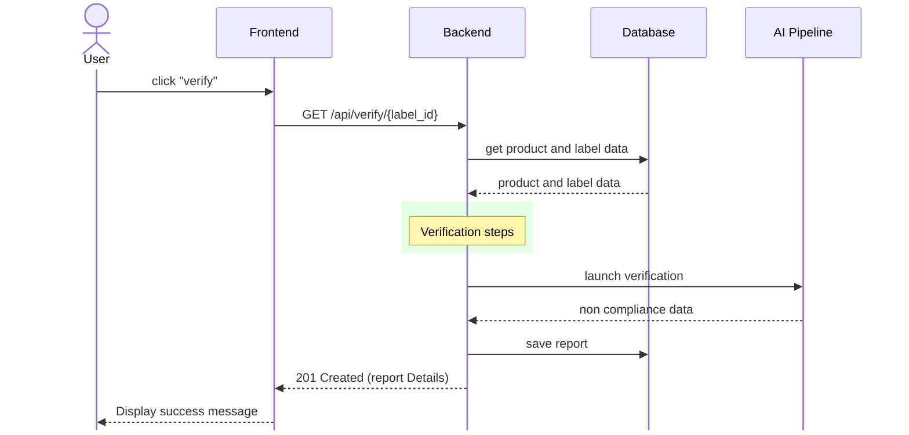

# General Design of verification

```mermaid
%%{init: { "sequence": { "mirrorActors": false } }}%%
sequenceDiagram
    actor usr as User
    participant fe as Frontend
    participant be as Backend
    participant db as Database
    actor usr as User
    participant fe as Frontend
    participant be as Backend
    participant db as Database
    participant ai as AI Pipeline

    usr ->> fe : click "verify"
    fe ->> be : GET /api/verify/{label_id}


    be ->> db : get product and label data
    db -->> be : product and label data

    rect rgba(0,250,0,0.1)
        note over be: Verification steps
    end

    be ->> ai: launch verification
    ai -->> be: non compliance data

    be ->> db : save report

    be -->> fe: 201 Created (report Details)

    fe -->> usr: Display success message
```
