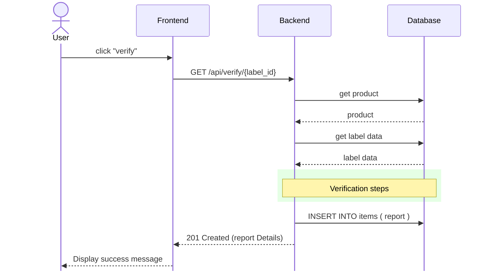

# General Design of verification

```mermaid
%%{init: { "sequence": { "mirrorActors": false } }}%%
sequenceDiagram
    actor usr as User
    participant fe as Frontend
    participant be as Backend
    participant db as Database

    usr ->> fe : click "verify"
    fe ->> be : GET /api/verify/{label_id}

    be ->> db : get product
    db -->> be : product
    be ->> db : get label data
    db -->> be: label data

    rect rgba(0,250,0,0.1)
        note over be,db: Verification steps
    end

    be ->> db : INSERT INTO items ( report )

    be -->> fe: 201 Created (report Details)

    fe -->> usr: Display success message
```
