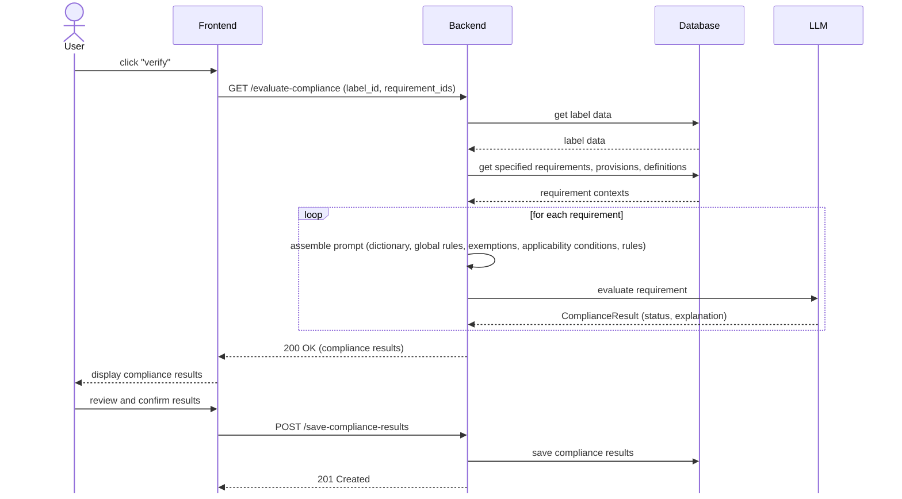
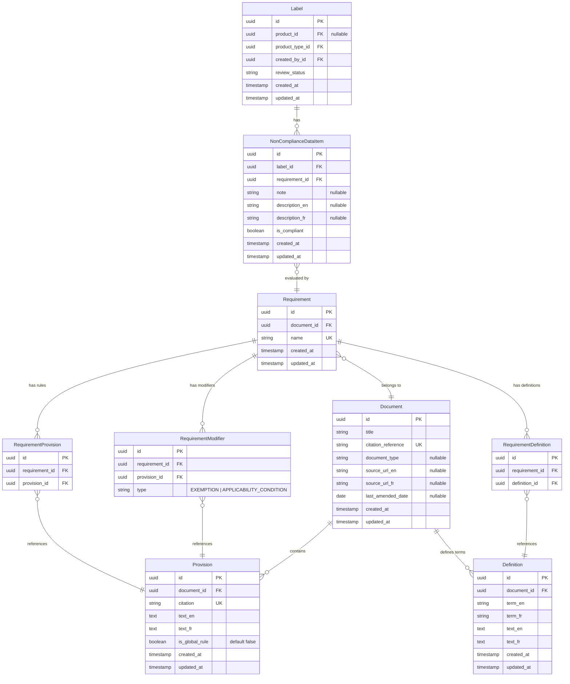

# General Design

## Compliance Evaluation



## ERD



## LLM Response Format

The LLM response is parsed into a structured `ComplianceResult`:

```python
class ComplianceResult(BaseModel):
    status: Literal["COMPLIANT", "NON_COMPLIANT", "NOT_APPLICABLE"]
    explanation_en: str
    explanation_fr: str
```

- `COMPLIANT` — The label satisfies the requirement.
- `NON_COMPLIANT` — The label violates the requirement.
- `NOT_APPLICABLE` — An exemption or applicability condition short-circuited the
  evaluation.

## Prompt Engineering

The compliance prompt template `compliance_verification.md` injects separated
context sections built from the `Requirement` hub. The template follows this
structure:

````markdown
# Compliance Verification

## Role

You are a Regulatory Compliance Engine. Your sole purpose is to verify if a
product's label data adheres to a specific regulatory requirement.

## Verification Protocol

1. Consult the **Dictionary** to establish the strict legal definitions of
   terms used in the subsequent texts.
2. Evaluate the **Global Rules**. If the product is globally exempt or
   fundamentally violates a core prohibition, stop and return the overarching
   result.
3. Evaluate the **Exemptions**. If any exemption applies to the product,
   stop and return "Not Applicable" for this check.
4. Evaluate the **Applicability Conditions**. If any condition is not met,
   stop and return "Not Applicable" for this check.
5. Evaluate compliance exclusively against the **Rules**.

## Constraints

- Do not assume the presence of data not explicitly provided in the Label Data.
- Base your decision solely on the provided legal texts and data.
- Support your conclusion with specific evidence from the Label Data.
- Apply definitions from the Dictionary strictly — do not use colloquial
  interpretations of legal terms.

## Dictionary

```text
{{ dictionary }}
```

## Global Rules

```text
{{ global_rules }}
```

## Exemptions

```text
{{ exemptions }}
```

## Applicability Conditions

```text
{{ applicability_conditions }}
```

## Rules

```text
{{ rules }}
```

## Label Data

```json
{{ label_data }}
```
````

## Considered Alternatives

- **Knowledge Graph:** The current relational model acts as a manually curated
  graph. To explore later.
- **RAG:** Skipped to prioritize precision for safety-critical checks. To
  explore later.

## Limitations & Improvements

- **Cost/Latency:** Global rules are repeatedly injected and evaluated for
  _every_ requirement. If a product is globally exempt, `N` LLM calls calculate
  the same short-circuit.
- **Improvement:** Introduce a preliminary orchestration step: evaluate Global
  Rules _once_. If broadly exempt or prohibited, halt the entire process. If
  applicable, fan out to evaluate individual requirements.
