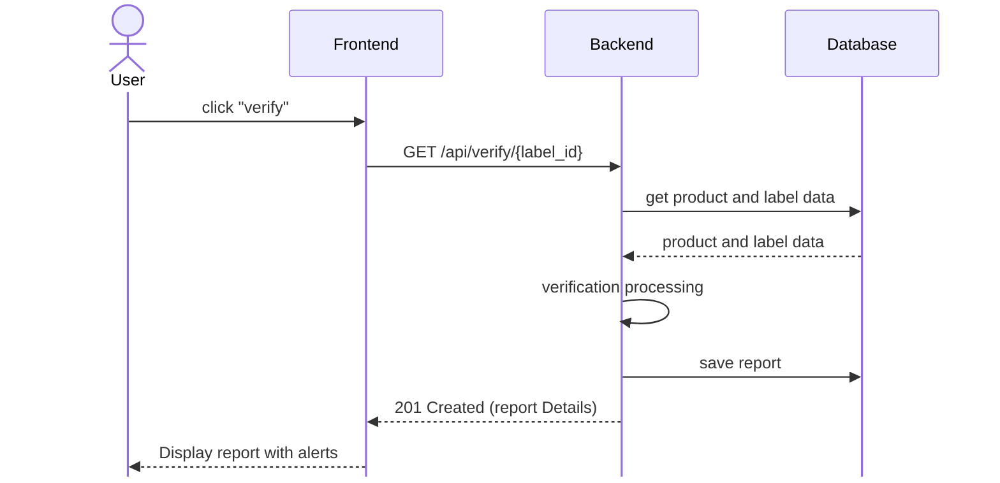
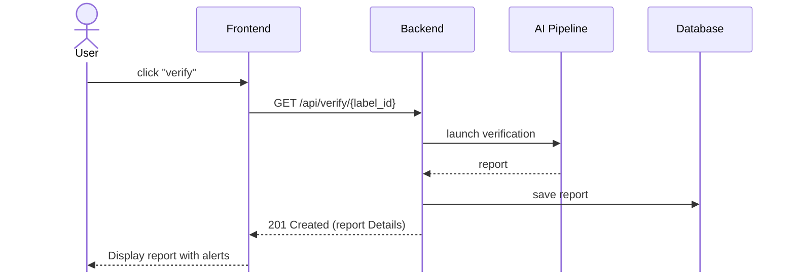

# General Design

## Local verification

```mermaid
%%{init: { "sequence": { "mirrorActors": false } }}%%
sequenceDiagram
    actor usr as User
    participant fe as Frontend
    participant be as Backend
    participant db as Database
    usr ->> fe : click "verify"
    fe ->> be : GET /api/verify/{label_id}


    be ->> db : get product and label data
    db -->> be : product and label data

    be ->> be : verification processing

    be ->> db : save report

    be -->> fe: 201 Created (report Details)

    fe -->> usr: Display report with alerts
```

## AI Verification

```mermaid
%%{init: { "sequence": { "mirrorActors": false } }}%%
sequenceDiagram
    actor usr as User
    participant fe as Frontend
    participant be as Backend
    participant ai as AI Pipeline
    participant db as Database

    usr ->> fe : click "verify"
    fe ->> be : GET /api/verify/{label_id}

    be ->> ai : launch verification
    ai -->> be : report

    be ->> db : save report

    be -->> fe: 201 Created (report Details)
    fe -->> usr: Display report with alerts

```
