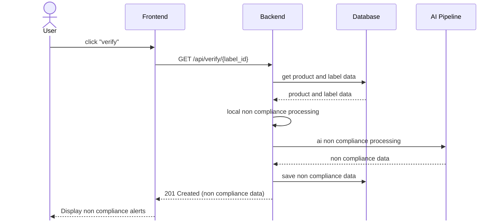

# General Design

## Local verification

```mermaid
%%{init: { "sequence": { "mirrorActors": false } }}%%
sequenceDiagram
    actor usr as User
    participant fe as Frontend
    participant be as Backend
    participant db as Database
    participant ai as AI Pipeline

    usr ->> fe : click "verify"
    fe ->> be : GET /api/verify/{label_id}

    be ->> db : get product and label data
    db -->> be : product and label data

    be ->> be : local non compliance processing
    be ->> ai : ai non compliance processing
    ai -->> be : non compliance data

    be ->> db : save non compliance data

    be -->> fe: 201 Created (non compliance data)

    fe -->> usr: Display non compliance alerts
```
