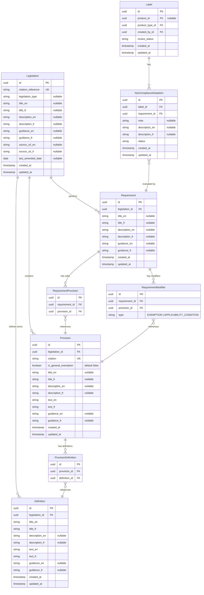

# ERD

```mermaid
erDiagram

    %% 1. The Container Layer (Legislation)
    Legislation ||--o{ Requirement : "governs"
    Legislation ||--o{ Provision : "contains"
    Legislation ||--o{ Definition : "defines terms"
    %% 2. The Relationship Hub (Requirement)
    Requirement ||--o{ RequirementProvision : "has rules"
    Requirement ||--o{ RequirementModifier : "has modifiers"

    %% 3. The Structural Units (Join Table Links)
    RequirementProvision }o--|| Provision : "references"
    RequirementModifier }o--|| Provision : "references"

    %% 4. The Glossary (Provision-Definition)
    Provision ||--o{ ProvisionDefinition : "has definitions"
    ProvisionDefinition }o--|| Definition : "references"

    %% 5. The Execution Layer (Label Evaluation)
    Label ||--o{ NonComplianceDataItem : "has"
    NonComplianceDataItem }o--|| Requirement : "evaluated by"

    Legislation {
        uuid id PK
        string citation_reference UK
        string legislation_type "nullable"
        string title_en "nullable"
        string title_fr "nullable"
        string description_en "nullable"
        string description_fr "nullable"
        string guidance_en "nullable"
        string guidance_fr "nullable"
        string source_url_en "nullable"
        string source_url_fr "nullable"
        date last_amended_date "nullable"
        timestamp created_at
        timestamp updated_at
    }

    Provision {
        uuid id PK
        uuid legislation_id FK
        string citation UK
        boolean is_general_exemption "default false"
        string title_en "nullable"
        string title_fr "nullable"
        string description_en "nullable"
        string description_fr "nullable"
        string text_en
        string text_fr
        string guidance_en "nullable"
        string guidance_fr "nullable"
        timestamp created_at
        timestamp updated_at
    }

    Definition {
        uuid id PK
        uuid legislation_id FK
        string title_en
        string title_fr
        string description_en "nullable"
        string description_fr "nullable"
        string text_en
        string text_fr
        string guidance_en "nullable"
        string guidance_fr "nullable"
        timestamp created_at
        timestamp updated_at
    }

    Requirement {
        uuid id PK
        uuid legislation_id FK
        string title_en "nullable"
        string title_fr "nullable"
        string description_en "nullable"
        string description_fr "nullable"
        string guidance_en "nullable"
        string guidance_fr "nullable"
        timestamp created_at
        timestamp updated_at
    }

    RequirementProvision {
        uuid id PK
        uuid requirement_id FK
        uuid provision_id FK
    }

    RequirementModifier {
        uuid id PK
        uuid requirement_id FK
        uuid provision_id FK
        string type "EXEMPTION | APPLICABILITY_CONDITION"
    }

    ProvisionDefinition {
        uuid id PK
        uuid provision_id FK
        uuid definition_id FK
    }

    NonComplianceDataItem {
        uuid id PK
        uuid label_id FK
        uuid requirement_id FK
        string note "nullable"
        string description_en "nullable"
        string description_fr "nullable"
        string status
        timestamp created_at
        timestamp updated_at
    }

    Label {
        uuid id PK
        uuid product_id FK "nullable"
        uuid product_type_id FK
        uuid created_by_id FK
        string review_status
        timestamp created_at
        timestamp updated_at
    }

```
