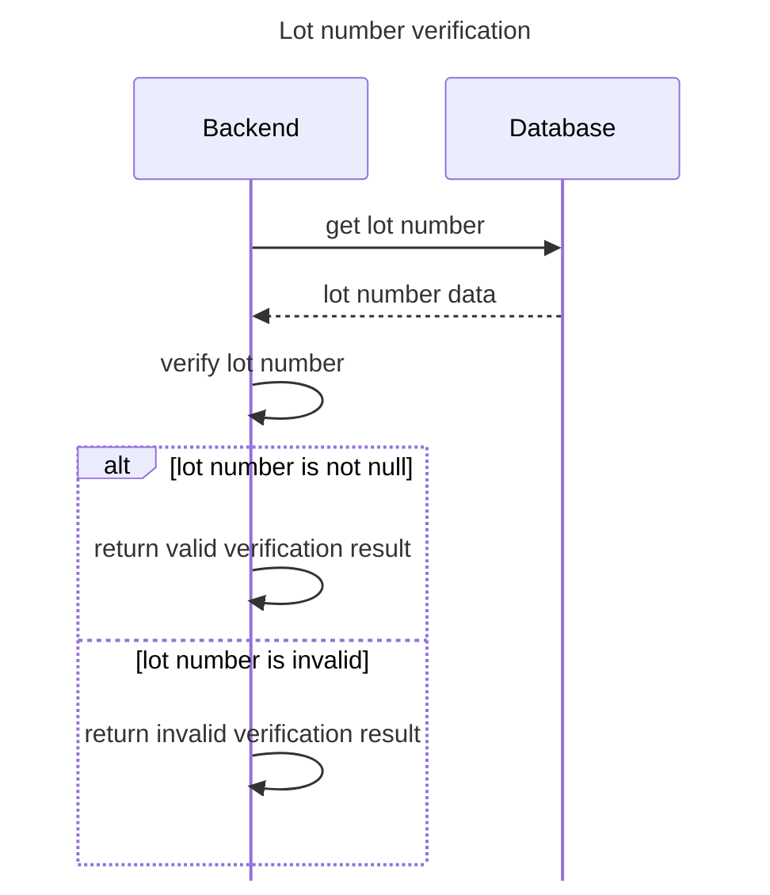

# Design for lot_number

```mermaid
%%{init: { "sequence": { "mirrorActors": false } }}%%
sequenceDiagram
    title Lot number verification
    participant be as Backend
    participant db as Database

    be ->> db : get lot number
    db -->> be : lot number data

    be ->> be : verify lot number
    alt lot number is not null
        be ->> be : return valid verification result
    else lot number is invalid
        be ->> be : return invalid verification result
    end
```
