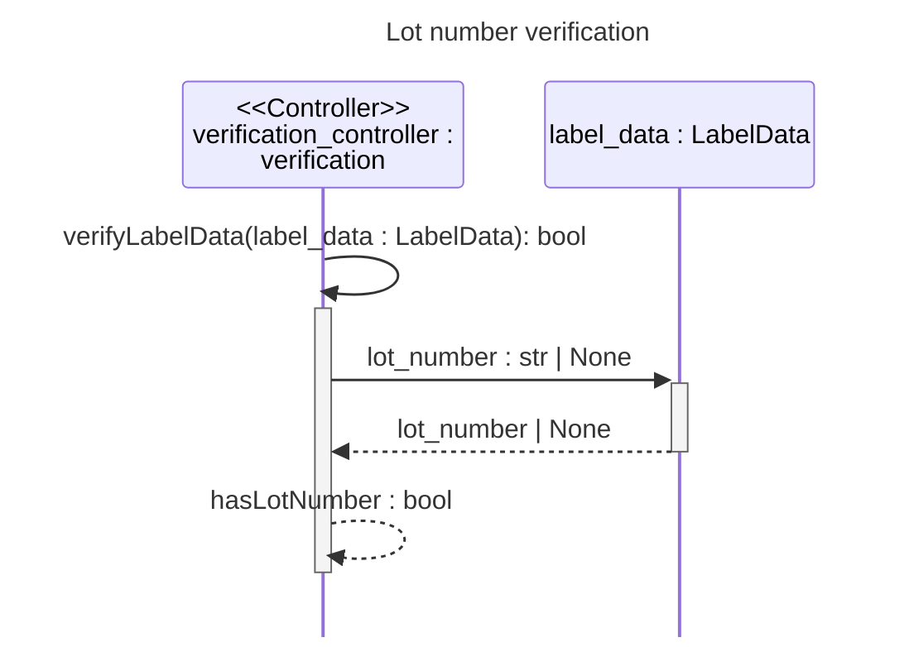

# Design for lot_number

```mermaid
%%{init: { "sequence": { "mirrorActors": false } }}%%
sequenceDiagram
    title Lot number verification
    participant ver as <<Controller>><br>verification_controller : <br> verification
    participant ld as label_data : LabelData

    ver ->>+ ver: verifyLabelData(label_data : LabelData): bool

    ver ->>+ ld: lot_number :  str | None
    ld -->>- ver: lot_number | None

    ver -->>- ver: hasLotNumber : bool


```
