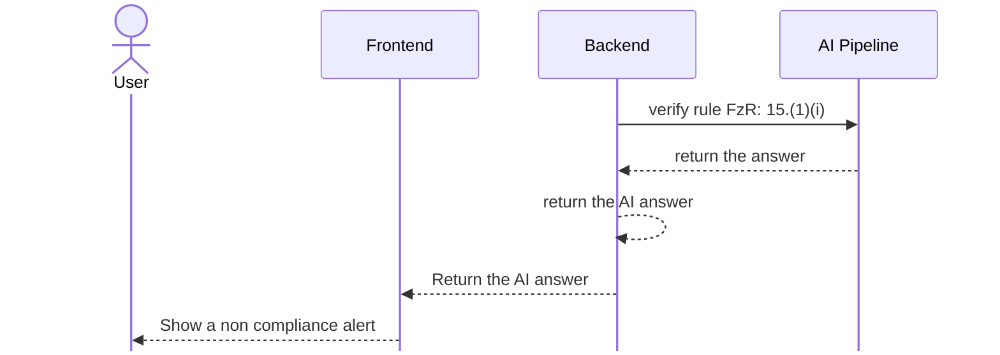
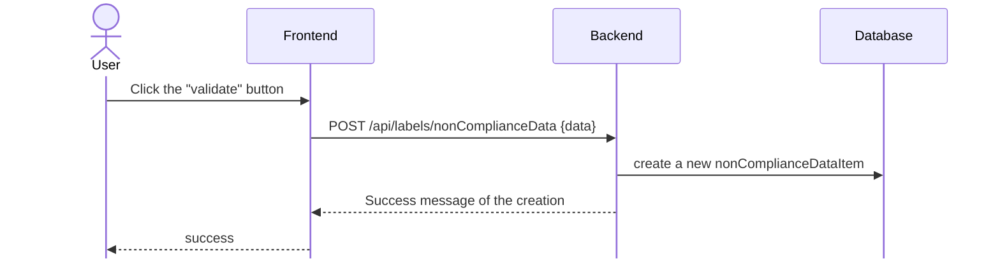

# Organic Matter design

## Analyze process



## Validate and create a non compliance item



## Engineering Prompt

```python
    from [...] import verify_organic_matter
    from app.db.models.label import Label
    import json

    def message_organic_matter(label : Label, [...]) -> str :
        fertilizer_label_data = label.fertilizer_label_data
        ingredients = fertilizer_label_data.ingredients
        guaranteed_analysis = fertilizer_label_data.guaranteed_analysis

        msg =(
             "This is the first part of data, the ingredient :\n"
             f"{json.dumps(ingredients,indent=2, ensure_ascii=False)}\n\n"
             "This is the second part of data, guaranteed analysis :\n"
             f"{json.dumps(guaranteed_analysis, indent=2, ensure_ascii=False)}"
        )

       return msg


```

## Exit message

```python
    import instructor
    from pydantic import BaseModel, Field
    from app.config import settings
    from app.db.models.rule import Rule

    class ComplianceResult(BaseModel):
        explanation: str = Field(
            ...,
            description="Step-by-step reasoning citing specific evidence from the Label Data that supports or contradicts the regulation's requirements.",
        )
        is_compliant: bool = Field(
            ...,
            description="Whether the Label Data satisfies the requirements of the Regulation to Enforce.",
        )

    @validate_call(config={"arbitrary_types_allowed": True})
    def verify_organic_matter(
        instructor : instructor,
        message : str,
        rule : Rule,
    ) -> CompliantResponseLLM:

        content = (
            "This is the rule I want to apply on the data :\n"
            f"{json.dumps(rule, indent=2, ensure_ascii=False)}\n\n"
            f"{message}"
        )
        response, _ =  await instructor.chat.completions.create_with_completion(
            model=settings.AZURE_OPENAI_MODEL,
            message=[{"role": "user", "content": f"Analyze this : {content}" }],
            response_model = CompliantResponseLLM,
            max_completion_tokens=4000,
         )

        return response

```
