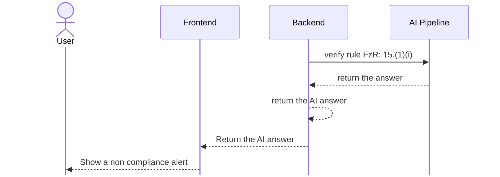
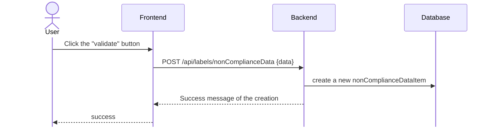

# Organic Matter design

## Analyze process



## Validate and create a non compliance item



## Engineering Prompt

```python
from [...] import verify_organic_matter
from app.db.models.label import Label
from app.db.models.rule import Rule
import json
from app.config import settings

def prompt_organic_matter(label : Label, rule : Rule) -> str :
    fertilizer_label_data = label.fertilizer_label_data
    ingredients = fertilizer_label_data.ingredients
    guaranteed_analysis = fertilizer_label_data.guaranteed_analysis

    prompt_template_env =settings.prompt_template_env
    template = prompt_template_env.get_template("compliance_verification.md")
    label_data =  {ingredients,guaranteed_analysis }

    prompt = template.render(
        rule_data=json.dumps(rule, indent=2),
        label_data=json.dumps(label_data, indent=2),
    )
    return prompt


```

## Exit message

```python
import instructor
from pydantic import BaseModel, Field
from app.config import settings


class ComplianceResult(BaseModel):
    explanation_en: str = Field(
        ...,
        description="Step-by-step reasoning citing specific evidence from the"+
        " Label Data that supports or contradicts the regulation's requirements."+
        "in English",
    )
    explanation_fr : str = Field(
        ...,
        description="Step-by-step reasoning citing specific evidence from the"+
        " Label Data that supports or contradicts the regulation's requirements."+
        "in French",
    )
    is_compliant: bool = Field(
        ...,
        description="Whether the Label Data satisfies the requirements of the "+
        " Regulation to Enforce.",
    )

@validate_call(config={"arbitrary_types_allowed": True})
def verify_rule_with_llm(
    instructor : instructor,
    content : str,
) -> CompliantResponseLLM:

    response, _ =  await instructor.chat.completions.create_with_completion(
        model=settings.AZURE_OPENAI_MODEL,
        message=[{"role": "user", "content": f"Analyze this : {content}" }],
        response_model = CompliantResponseLLM,
        max_completion_tokens=4000,
        )

    return response

```
