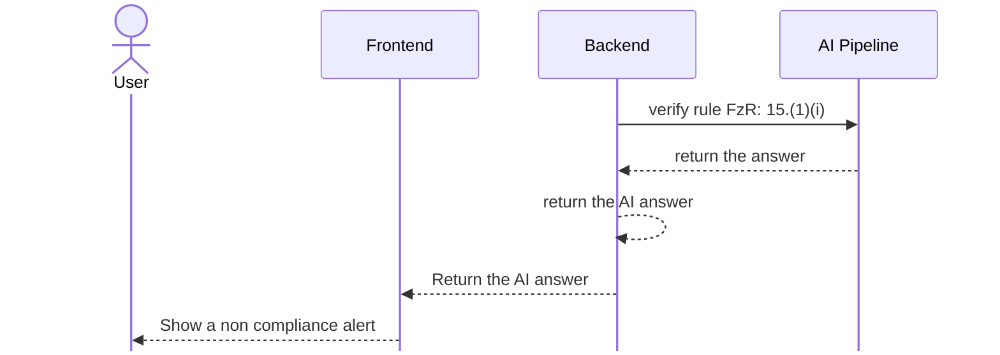
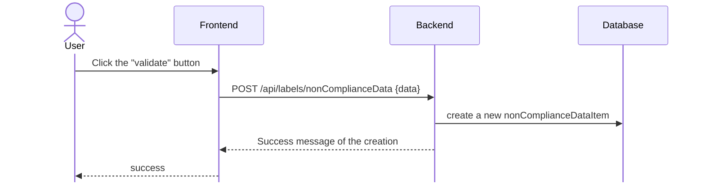

# Organic Matter design

## Analyze process



## Validate and create a non compliance item



## Engineering Prompt

```python
    from [...] import verify_organic_matter
    from app.db.models.label import Label


    def message_organic_matter(label : Label, [...]) -> str :
        fertilizer_label_data = label.fertilizer_label_data

       return str(fertilizer_label_data)


```

## Exit message

```python
    import instructor
    from pydantic import BaseModel, Field
    from app.config import settings

    class LabelModelResponse(BaseModel):
        explanation : str = Field(..., description="Explanation of all field answer")
        is_Organic : bool = Field(...,description ="label contains Organic matter")
        verify : tuple(str ,bool ) = Field(...,description= "Check if the label"+
        " shows the percentage of humidity and/or the percentage of organic matter")

    @validate_call(config={"arbitrary_types_allowed": True})
    def verify_organic_matter(
        instructor : instructor,
        message : message
    ) -> LabelModelResponse:
        response, _ =  await instructor.chat.completions.create_with_completion(
            model=settings.AZURE_OPENAI_MODEL,
            message=[{"role": "user", "content": f"Analyze this : {message}" }],
            response_model = LabelModelResponse,
            max_completion_tokens=4000,
         )

        return response

```
