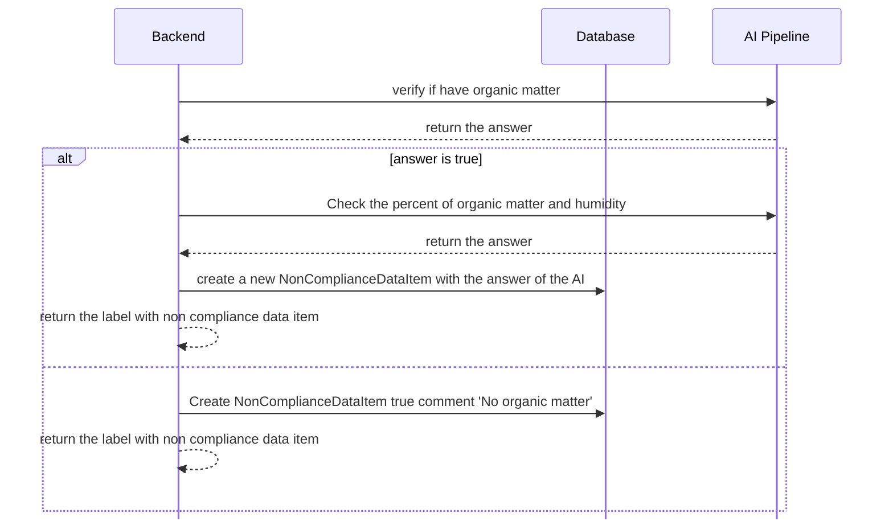

# Organic Matter design

```mermaid
%%{init: { "sequence": { "mirrorActors": false } }}%%
sequenceDiagram
    participant be as Backend
    participant db as Database
    participant ai as AI Pipeline

    be ->> ai: verify if have organic matter
    ai -->> be: return the answer
    alt  answer is true

    be ->> ai: Check the percent of organic matter and humidity

    ai -->> be: return the answer
    be ->> db : create a new NonComplianceDataItem with the answer of the AI
    be -->> be: return the label with non compliance data item

    else

    be ->> db: Create NonComplianceDataItem true comment 'No organic matter'

    be -->> be: return the label with non compliance data item

    end


```
