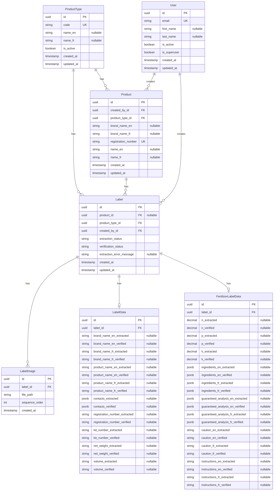

# Entity Relationship Diagram

## ERD



## Label Status State Machine

Labels track state through two status fields (one per major step):

### Extraction Status (`extraction_status`)

- **`pending`**: Extraction not started
- **`in_progress`**: Extraction running
- **`completed`**: Extraction finished successfully
- **`failed`**: Extraction failed

**Transitions:** `pending` → `in_progress` → `completed` / `failed` → `pending`
(retry)

**Business Rules**:

- Requires at least 1 image to initiate extraction
- Supports manual data entry without extraction (0 images)
- Partial extraction results are supported
- Extraction error details stored in `extraction_error_message` when failed

### Verification Status (`verification_status`)

- **`not_started`**: Verification not begun
- **`in_progress`**: User verifying/correcting data
- **`completed`**: All fields verified

**Transitions:** `not_started` → `in_progress` → `completed` → `in_progress`
(reversal)

**Business Rules**:

- Can start with extracted data OR manual entry
- Field-level verification (incremental, persisted)
- Completion requires all fields verified
- Product update prompt after completion (optional)

## Key Design Decisions

### Nullable Fields

- **`Label.product_id`**: Nullable to support standalone labels (REQ-LM-016)
- **`LabelData` fields**: All nullable to support partial extraction and manual
  entry
- **`FertilizerLabelData`**: Optional, only created for fertilizer labels
- **`FertilizerLabelData` fields**: All nullable to support partial extraction
  and manual entry
- **`Label.extraction_error_message`**: Nullable, only populated when extraction
  fails

### Status Tracking

- **Two status fields on Label**: `extraction_status`, `verification_status`
- **LabelData creation**: Created lazily when extraction completes or when user
  starts manual entry (not always present)
- **FertilizerLabelData creation**: Created lazily for fertilizer labels when
  extraction completes or when user starts manual entry (optional, only for
  fertilizer labels)

### Field Verification

- Verification means copying values from `*_extracted` fields to `*_verified`
  fields
- A field is considered verified when its `*_verified` field has a value
  (non-null)
- Users can verify fields individually, and verification state is saved
  incrementally
- Manual entry allowed at any time (regardless of extraction status)

### Image Management

- Images stored in separate `LabelImage` entity with sequence order
- Sequence order matters for extraction processing
- Image changes cascade invalidate extraction and verification results

### Product-Label Relationship

- Labels can exist without products (standalone)
- Auto-linking after extraction via registration number matching
- Manual linking/unlinking/reassignment supported
- Product deletion requires explicit handling of associated labels

### Bilingual Support

- **Bilingual fields**: `brand_name` and `product_name` stored as separate
  columns for English (`_en`) and French (`_fr`) to comply with Canadian
  labeling requirements
- **Product entity**: `brand_name_en`, `brand_name_fr`, `name_en`, `name_fr`
- **LabelData entity**: `brand_name_en_extracted/verified`,
  `brand_name_fr_extracted/verified`, `product_name_en_extracted/verified`,
  `product_name_fr_extracted/verified`
- **FertilizerLabelData entity**: `caution_en_extracted/verified`,
  `caution_fr_extracted/verified`, `instructions_en_extracted/verified`,
  `instructions_fr_extracted/verified`
- **French fields nullable**: French versions are nullable as not all products may
  have French labels, but English is typically required

### Product Type Management

- **ProductType table**: Central registry of product types (fertilizer, pesticide,
  etc.)
  - `code`: Unique identifier (e.g., "fertilizer", "pesticide")
  - `name_en`/`name_fr`: Display names for i18n support (both nullable for
    flexibility)
  - `is_active`: Allows disabling types without deleting data
- **Product.product_type_id**: Foreign key to ProductType (required)
- **Label.product_type_id**: Foreign key to ProductType (required, even for
  standalone labels)
  - Labels always have an explicit product type, even when not linked to a product
  - Enables efficient filtering and querying by product type

### Product Type Separation

- **Generic fields in LabelData**: Common fields shared across all product types
  (brand_name_en/fr, product_name_en/fr, registration_number, lot_number,
  contacts, net_weight, volume)
- **Fertilizer-specific fields in FertilizerLabelData**: NPK values (n, p, k),
  ingredients_en/fr, guaranteed_analysis_en/fr, caution_en/fr, and
  instructions_en/fr specific to fertilizer products
- **Extensibility**: Other product types can have their own label data tables
  (e.g., `PesticideLabelData`) following the same pattern
- **Optional relationship**: `FertilizerLabelData` is optional (0..1), only
  created when the label is for a fertilizer product
- **Type-specific table mapping**: The ProductType table serves as a registry,
  while type-specific tables (FertilizerLabelData, etc.) are created via code
  and migrations. This mismatch is acceptable because:
  - Product types are domain concepts requiring code changes anyway (UI,
    validation, extraction logic)
  - Type-specific tables provide queryability and type safety
  - ProductType table enables efficient filtering without relationship checks

### Structured Data Fields (JSONB)

**Note:** JSONB fields are temporary and may be normalized into separate tables
in the future for better queryability and structure.

All JSONB fields follow a consistent structure. Expected formats:

#### `contacts_extracted/verified` (in LabelData)

Array of contact information objects:

```json
[
  {
    "type": "manufacturer",
    "name": "ABC Fertilizer Co.",
    "address": "123 Main St, City, State, ZIP",
    "phone": "1-800-123-4567",
    "email": "info@abc.com",
    "website": "https://www.abc.com"
  },
  {
    "type": "distributor",
    "name": "XYZ Distribution",
    "address": "456 Oak Ave, City, State, ZIP",
    "phone": "1-800-987-6543"
  }
]
```

**Fields:**

- `type` (string): Type of contact (manufacturer, distributor, importer, etc.)
- `name` (string): Company name
- `address` (string, optional): Full address
- `phone` (string, optional): Phone number
- `email` (string, optional): Email address
- `website` (string, optional): Website URL

#### `ingredients_en/fr_extracted/verified` (in FertilizerLabelData)

Array of ingredient objects with optional nested sub-ingredients:

```json
[
  {
    "name": "Urea",
    "value": 46.0,
    "unit": "%"
  },
  {
    "name": "Total Nitrogen",
    "value": 10.0,
    "unit": "%",
    "sub_ingredients": [
      { "name": "Ammoniacal Nitrogen", "value": 5.0, "unit": "%" },
      { "name": "Urea Nitrogen", "value": 5.0, "unit": "%" }
    ]
  }
]
```

**Fields:**

- `name` (string): Ingredient name
- `value` (decimal): Ingredient value/percentage
- `unit` (string): Unit of measurement (typically "%")
- `sub_ingredients` (array, optional): Nested array of sub-ingredient objects
  with same structure

#### `guaranteed_analysis_en/fr_extracted/verified` (in FertilizerLabelData)

Object containing analysis title and nutrients array:

```json
{
  "title": "Minimum Guaranteed Analysis",
  "is_minimum": true,
  "nutrients": [
    {
      "name": "Total Nitrogen (N)",
      "value": 10.0,
      "unit": "%"
    },
    {
      "name": "Available Phosphate (P₂O₅)",
      "value": 20.0,
      "unit": "%"
    },
    {
      "name": "Calcium (Ca)",
      "value": 1.0,
      "unit": "%"
    }
  ]
}
```

**Fields:**

- `title` (string): Section title from label ("Minimum Guaranteed Analysis" or
  "Guaranteed Analysis")
- `is_minimum` (boolean): True if title contains "Minimum", false otherwise
- `nutrients` (array): Array of nutrient objects, each containing:
  - `name` (string): Nutrient name (e.g., "Total Nitrogen (N)")
  - `value` (decimal): Nutrient percentage value
  - `unit` (string): Unit of measurement (typically "%")

### Audit Trail

- **`Product.created_by_id`**: Tracks who created each product (required for
  regulatory compliance)
- **`Label.created_by_id`**: Tracks who created each label (audit trail)
- Both fields are non-nullable to ensure complete audit trail

## Example Records

The following examples demonstrate realistic data records for each entity,
showing different states and relationships.

### User Record

```json
{
  "id": "550e8400-e29b-41d4-a716-446655440000",
  "email": "inspector@cfia.gc.ca",
  "first_name": "Jane",
  "last_name": "Smith",
  "is_active": true,
  "is_superuser": false,
  "created_at": "2025-01-15T10:30:00Z",
  "updated_at": "2025-01-15T10:30:00Z"
}
```

### ProductType Record

```json
{
  "id": "440e8400-e29b-41d4-a716-446655440000",
  "code": "fertilizer",
  "name_en": "Fertilizer",
  "name_fr": "Engrais",
  "is_active": true,
  "created_at": "2025-01-01T00:00:00Z",
  "updated_at": "2025-01-01T00:00:00Z"
}
```

### Product Record

```json
{
  "id": "660e8400-e29b-41d4-a716-446655440001",
  "created_by_id": "550e8400-e29b-41d4-a716-446655440000",
  "product_type_id": "440e8400-e29b-41d4-a716-446655440000",
  "brand_name_en": "GreenGrow",
  "brand_name_fr": "CroissanceVerte",
  "registration_number": "12345-2024",
  "name_en": "All-Purpose Fertilizer 10-20-10",
  "name_fr": "Engrais polyvalent 10-20-10",
  "created_at": "2025-01-20T14:15:00Z",
  "updated_at": "2025-01-25T09:20:00Z"
}
```

### Label Records (Different States)

#### Label 1: Standalone, Extraction Pending

```json
{
  "id": "770e8400-e29b-41d4-a716-446655440002",
  "product_id": null,
  "product_type_id": "440e8400-e29b-41d4-a716-446655440000",
  "created_by_id": "550e8400-e29b-41d4-a716-446655440000",
  "extraction_status": "pending",
  "verification_status": "not_started",
  "extraction_error_message": null,
  "created_at": "2025-01-27T08:00:00Z",
  "updated_at": "2025-01-27T08:00:00Z"
}
```

#### Label 2: Linked, Extraction Completed, Verification In Progress

```json
{
  "id": "880e8400-e29b-41d4-a716-446655440003",
  "product_id": "660e8400-e29b-41d4-a716-446655440001",
  "product_type_id": "440e8400-e29b-41d4-a716-446655440000",
  "created_by_id": "550e8400-e29b-41d4-a716-446655440000",
  "extraction_status": "completed",
  "verification_status": "in_progress",
  "extraction_error_message": null,
  "created_at": "2025-01-27T08:05:00Z",
  "updated_at": "2025-01-27T10:30:00Z"
}
```

#### Label 3: Extraction Failed

```json
{
  "id": "990e8400-e29b-41d4-a716-446655440004",
  "product_id": null,
  "product_type_id": "440e8400-e29b-41d4-a716-446655440000",
  "created_by_id": "550e8400-e29b-41d4-a716-446655440000",
  "extraction_status": "failed",
  "verification_status": "not_started",
  "extraction_error_message": "OCR service timeout after 30s",
  "created_at": "2025-01-27T09:00:00Z",
  "updated_at": "2025-01-27T09:02:15Z"
}
```

### LabelImage Records

Images for Label 2 (linked, extraction completed):

```json
[
  {
    "id": "aa0e8400-e29b-41d4-a716-446655440005",
    "label_id": "880e8400-e29b-41d4-a716-446655440003",
    "file_path": "labels/880e8400/label_front.jpg",
    "sequence_order": 1,
    "created_at": "2025-01-27T08:05:00Z"
  },
  {
    "id": "bb0e8400-e29b-41d4-a716-446655440006",
    "label_id": "880e8400-e29b-41d4-a716-446655440003",
    "file_path": "labels/880e8400/label_back.jpg",
    "sequence_order": 2,
    "created_at": "2025-01-27T08:05:00Z"
  }
]
```

### LabelData Record

LabelData for Label 2, showing partial verification (some fields verified,
others still only extracted):

```json
{
  "id": "cc0e8400-e29b-41d4-a716-446655440007",
  "label_id": "880e8400-e29b-41d4-a716-446655440003",
  "brand_name_en_extracted": "GreenGrow",
  "brand_name_en_verified": "GreenGrow",
  "brand_name_fr_extracted": "CroissanceVerte",
  "brand_name_fr_verified": "CroissanceVerte",
  "product_name_en_extracted": "All-Purpose Fertilizer 10-20-10",
  "product_name_en_verified": "All-Purpose Fertilizer 10-20-10",
  "product_name_fr_extracted": "Engrais polyvalent 10-20-10",
  "product_name_fr_verified": "Engrais polyvalent 10-20-10",
  "contacts_extracted": [
    {
      "type": "manufacturer",
      "name": "GreenGrow Industries Inc.",
      "address": "123 Farm Road, Ottawa, ON K1A 0B1",
      "phone": "1-613-555-0123",
      "email": "info@greengrow.ca",
      "website": "https://www.greengrow.ca"
    }
  ],
  "contacts_verified": [
    {
      "type": "manufacturer",
      "name": "GreenGrow Industries Inc.",
      "address": "123 Farm Road, Ottawa, ON K1A 0B1",
      "phone": "1-613-555-0123",
      "email": "info@greengrow.ca",
      "website": "https://www.greengrow.ca"
    }
  ],
  "registration_number_extracted": "12345-2024",
  "registration_number_verified": "12345-2024",
  "lot_number_extracted": "LOT-2024-001",
  "lot_number_verified": null,
  "net_weight_extracted": "25 kg",
  "net_weight_verified": null,
  "volume_extracted": null,
  "volume_verified": null
}
```

### FertilizerLabelData Record

FertilizerLabelData for Label 2, showing extracted values with some verified:

```json
{
  "id": "dd0e8400-e29b-41d4-a716-446655440008",
  "label_id": "880e8400-e29b-41d4-a716-446655440003",
  "n_extracted": 10.0,
  "n_verified": 10.0,
  "p_extracted": 20.0,
  "p_verified": 20.0,
  "k_extracted": 10.0,
  "k_verified": null,
  "ingredients_en_extracted": [
    {
      "name": "Urea",
      "value": 46.0,
      "unit": "%"
    },
    {
      "name": "Total Nitrogen",
      "value": 10.0,
      "unit": "%",
      "sub_ingredients": [
        {
          "name": "Ammoniacal Nitrogen",
          "value": 5.0,
          "unit": "%"
        },
        {
          "name": "Urea Nitrogen",
          "value": 5.0,
          "unit": "%"
        }
      ]
    }
  ],
  "ingredients_en_verified": [
    {
      "name": "Urea",
      "value": 46.0,
      "unit": "%"
    },
    {
      "name": "Total Nitrogen",
      "value": 10.0,
      "unit": "%",
      "sub_ingredients": [
        {
          "name": "Ammoniacal Nitrogen",
          "value": 5.0,
          "unit": "%"
        },
        {
          "name": "Urea Nitrogen",
          "value": 5.0,
          "unit": "%"
        }
      ]
    }
  ],
  "ingredients_fr_extracted": null,
  "ingredients_fr_verified": null,
  "guaranteed_analysis_en_extracted": {
    "title": "Minimum Guaranteed Analysis",
    "is_minimum": true,
    "nutrients": [
      {
        "name": "Total Nitrogen (N)",
        "value": 10.0,
        "unit": "%"
      },
      {
        "name": "Available Phosphate (P₂O₅)",
        "value": 20.0,
        "unit": "%"
      },
      {
        "name": "Soluble Potash (K₂O)",
        "value": 10.0,
        "unit": "%"
      }
    ]
  },
  "guaranteed_analysis_en_verified": {
    "title": "Minimum Guaranteed Analysis",
    "is_minimum": true,
    "nutrients": [
      {
        "name": "Total Nitrogen (N)",
        "value": 10.0,
        "unit": "%"
      },
      {
        "name": "Available Phosphate (P₂O₅)",
        "value": 20.0,
        "unit": "%"
      },
      {
        "name": "Soluble Potash (K₂O)",
        "value": 10.0,
        "unit": "%"
      }
    ]
  },
  "guaranteed_analysis_fr_extracted": null,
  "guaranteed_analysis_fr_verified": null,
  "caution_en_extracted": "Keep out of reach of children. Avoid contact with skin and eyes.",
  "caution_en_verified": "Keep out of reach of children. Avoid contact with skin and eyes.",
  "caution_fr_extracted": null,
  "caution_fr_verified": null,
  "instructions_en_extracted": "Apply evenly to soil surface. Water thoroughly after application.",
  "instructions_en_verified": null,
  "instructions_fr_extracted": null,
  "instructions_fr_verified": null
}
```

### Complete Scenario: Product with Multiple Labels

This example shows a Product with two associated Labels at different stages:

- **Product**: `660e8400-e29b-41d4-a716-446655440001` (from Product Record above)
- **Label A**: `880e8400-e29b-41d4-a716-446655440003` (extraction completed,
  verification in progress) - linked to Product
- **Label B**: `ee0e8400-e29b-41d4-a716-446655440009` (extraction completed,
  verification completed) - also linked to same Product

Label B (completed):

```json
{
  "id": "ee0e8400-e29b-41d4-a716-446655440009",
  "product_id": "660e8400-e29b-41d4-a716-446655440001",
  "product_type_id": "440e8400-e29b-41d4-a716-446655440000",
  "created_by_id": "550e8400-e29b-41d4-a716-446655440000",
  "extraction_status": "completed",
  "verification_status": "completed",
  "extraction_error_message": null,
  "created_at": "2025-01-26T14:00:00Z",
  "updated_at": "2025-01-26T16:45:00Z"
}
```

This demonstrates that multiple Labels can be linked to the same Product, each
tracking different label versions or scans independently.
