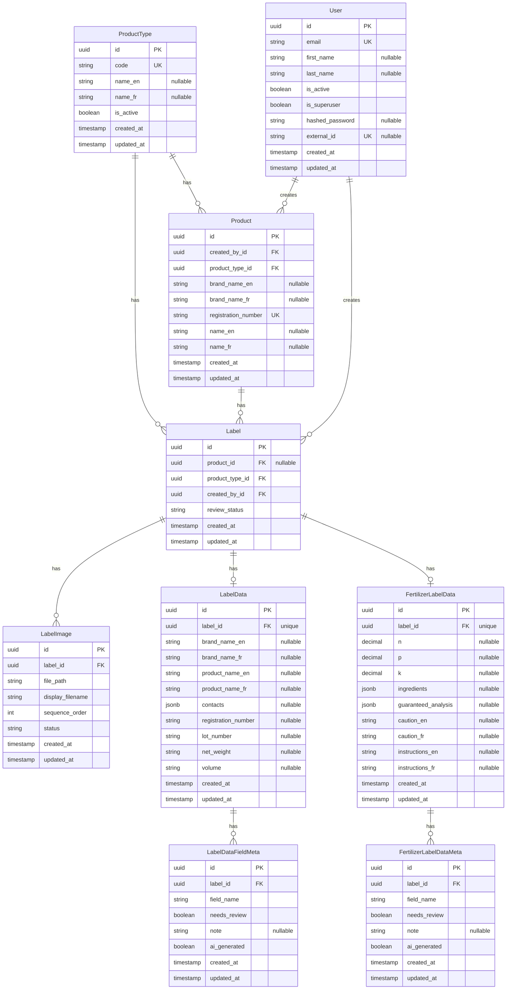

# Entity Relationship Diagram

## ERD



## Label Status State Machine

Labels track state through a single review status field:

### Review Status (`review_status`)

- **`not_started`**: Review/editing workflow not begun
- **`in_progress`**: User reviewing/editing data
- **`completed`**: Review/editing workflow completed

**Transitions:** `not_started` → `in_progress` → `completed` → `in_progress`
(reversal)

**Business Rules**:

- Represents the review/editing workflow, not verification of extracted vs
  verified values
- Extraction is a user-initiated tool, not a workflow state
- Data values are what matter, not extraction vs verification separation
- Field-level review flags and notes available for user workflow
  (indication/warning, don't block completion)
- Can start with AI-extracted data OR manual entry
- Manual entry allowed at any time

## Key Design Decisions

### Nullable Fields

- **`Label.product_id`**: Nullable to support standalone labels (REQ-LM-016)
- **`LabelData` fields**: All nullable to support partial extraction and manual
  entry
- **`FertilizerLabelData`**: Optional, only created for fertilizer labels
- **`FertilizerLabelData` fields**: All nullable to support partial extraction
  and manual entry

### Status Tracking

- **Single status field on Label**: `review_status` (tracks review/editing
  workflow)
- **LabelData creation**: Created lazily when data is entered (via extraction or
  manual entry)
- **FertilizerLabelData creation**: Created lazily for fertilizer labels when
  data is entered (optional, only for fertilizer labels)

### Field-Level Metadata and Review

- **Metadata tables**: `LabelDataFieldMeta` and `FertilizerLabelDataMeta`
  provide field-level metadata
  - One row per field per label data record
  - Fields: `needs_review` (bool), `note` (string, nullable), `ai_generated`
    (bool)
  - Unique constraint on `(label_id, field_name)`
  - `LabelDataFieldMeta.label_id` references `LabelData.id`
  - `FertilizerLabelDataMeta.label_id` references `FertilizerLabelData.id`
- **Lazy creation**: Meta rows are created when `needs_review=True`, `note` is
  added, or `ai_generated=True`
- **Lazy deletion**: Meta rows are deleted when `needs_review=False`,
  `note=None`, and `ai_generated=False`
- **Default behavior**: If no meta row exists, treat as `needs_review=False`,
  `note=None`, `ai_generated=False`
- **Field values**: Single value fields (no `*_extracted`/`*_verified` pairs)
- **Review flags**: Field-level review flags and notes for user workflow
  (indication/warning, don't block completion)
- **Manual entry**: Allowed at any time

### Image Management

- Images stored in separate `LabelImage` entity with sequence order
- Sequence order is 1-indexed (starts at 1, not 0)
- Sequence order matters for extraction processing
- `display_filename`: Original filename from upload (for user display)
- `status`: Upload status enum (`pending`, `completed`)
- When an individual image is deleted, remaining images are renumbered to
  maintain consecutive sequence order (1, 2, 3...)
- Storage path structure: `{app_prefix}/labels/{label_id}/{uuid}.{ext}` where
  app_prefix is configurable (e.g., "fertiscan") and UUID is the storage
  filename
- When a label is deleted, all associated storage files are also deleted
  synchronously

### Product-Label Relationship

- Labels can exist without products (standalone)
- Auto-linking after extraction via registration number matching
- Manual linking/unlinking/reassignment supported
- Product deletion requires explicit handling of associated labels

### Bilingual Support

- **Bilingual fields**: `brand_name` and `product_name` stored as separate
  columns for English (`_en`) and French (`_fr`) to comply with Canadian
  labeling requirements
- **Product entity**: `brand_name_en`, `brand_name_fr`, `name_en`, `name_fr`
- **LabelData entity**: `brand_name_en`, `brand_name_fr`, `product_name_en`,
  `product_name_fr`
- **FertilizerLabelData entity**: `caution_en`, `caution_fr`, `instructions_en`,
  `instructions_fr`
- **JSONB fields**: `ingredients` and `guaranteed_analysis` are single JSONB
  fields (not separate `_en`/`_fr` versions)
- **French fields nullable**: French versions are nullable as not all products
  may have French labels, but English is typically required

### Product Type Management

- **ProductType table**: Central registry of product types (fertilizer,
  pesticide, etc.)
  - `code`: Unique identifier (e.g., "fertilizer", "pesticide")
  - `name_en`/`name_fr`: Display names for i18n support (both nullable for
    flexibility)
  - `is_active`: Allows disabling types without deleting data
- **Product.product_type_id**: Foreign key to ProductType (required)
- **Label.product_type_id**: Foreign key to ProductType (required, even for
  standalone labels)
  - Labels always have an explicit product type, even when not linked to a
    product
  - Enables efficient filtering and querying by product type

### Product Type Separation

- **Generic fields in LabelData**: Common fields shared across all product types
  (brand_name_en/fr, product_name_en/fr, registration_number, lot_number,
  contacts, net_weight, volume)
- **Fertilizer-specific fields in FertilizerLabelData**: NPK values (n, p, k),
  ingredients (JSONB), guaranteed_analysis (JSONB), caution_en/fr, and
  instructions_en/fr specific to fertilizer products
- **Metadata tables**: Each label data table has a corresponding meta table
  (`LabelDataFieldMeta`, `FertilizerLabelDataMeta`) for field-level review
  flags, notes, and AI generation tracking
- **Extensibility**: Other product types can have their own label data tables
  (e.g., `PesticideLabelData`) and corresponding meta tables following the same
  pattern
- **Optional relationship**: `FertilizerLabelData` is optional (0..1), only
  created when the label is for a fertilizer product
- **Type-specific table mapping**: The ProductType table serves as a registry,
  while type-specific tables (FertilizerLabelData, etc.) are created via code
  and migrations. This mismatch is acceptable because:
  - Product types are domain concepts requiring code changes anyway (UI,
    validation, extraction logic)
  - Type-specific tables provide queryability and type safety
  - ProductType table enables efficient filtering without relationship checks

### Structured Data Fields (JSONB)

**Note:** JSONB fields are temporary and may be normalized into separate tables
in the future for better queryability and structure.

All JSONB fields follow a consistent structure. Expected formats:

#### `contacts` (in LabelData)

Array of contact information objects:

```json
[
  {
    "type": "manufacturer",
    "name": "ABC Fertilizer Co.",
    "address": "123 Main St, City, State, ZIP",
    "phone": "1-800-123-4567",
    "email": "info@abc.com",
    "website": "https://www.abc.com"
  },
  {
    "type": "distributor",
    "name": "XYZ Distribution",
    "address": "456 Oak Ave, City, State, ZIP",
    "phone": "1-800-987-6543"
  }
]
```

**Fields:**

- `type` (string): Type of contact (manufacturer, distributor, importer, etc.)
- `name` (string): Company name
- `address` (string, optional): Full address
- `phone` (string, optional): Phone number
- `email` (string, optional): Email address
- `website` (string, optional): Website URL

#### `ingredients` (in FertilizerLabelData)

Array of ingredient objects:

```json
[
  {
    "name_en": "Urea",
    "name_fr": "Urée",
    "value": "46.0",
    "unit": "%"
  },
  {
    "name_en": "Total Nitrogen",
    "name_fr": "Azote Total",
    "value": "10.0",
    "unit": "%"
  }
]
```

**Fields:**

- `name_en` (string): Ingredient name in English as it appears on the label
- `name_fr` (string, optional): Ingredient name in French as it appears on the
  label
- `value` (string): Ingredient percentage or amount
- `unit` (string): Unit of measurement (typically "%", "ppm", "mg/kg", "g/kg",
  "mm")

#### `guaranteed_analysis` (in FertilizerLabelData)

Object containing analysis title and nutrients array:

```json
{
  "title_en": "Minimum Guaranteed Analysis",
  "title_fr": "Analyse Garantie Minimale",
  "is_minimum": true,
  "nutrients": [
    {
      "name_en": "Total Nitrogen (N)",
      "name_fr": "Azote Total (N)",
      "value": 10.0,
      "unit": "%"
    },
    {
      "name_en": "Available Phosphate (P₂O₅)",
      "name_fr": "Phosphate Disponible (P₂O₅)",
      "value": 20.0,
      "unit": "%"
    },
    {
      "name_en": "Calcium (Ca)",
      "name_fr": "Calcium (Ca)",
      "value": 1.0,
      "unit": "%"
    }
  ]
}
```

**Fields:**

- `title_en` (string): Section title in English from label ("Minimum Guaranteed
  Analysis" or "Guaranteed Analysis")
- `title_fr` (string, optional): Section title in French from label
- `is_minimum` (boolean): True if title contains "Minimum", false otherwise
- `nutrients` (array): Array of nutrient objects, each containing:
  - `name_en` (string): Nutrient name in English (e.g., "Total Nitrogen (N)")
  - `name_fr` (string, optional): Nutrient name in French
  - `value` (decimal): Nutrient percentage value
  - `unit` (string): Unit of measurement (typically "%", "ppm", "mg/kg", "g/kg")

### Audit Trail

- **`Product.created_by_id`**: Tracks who created each product (required for
  regulatory compliance)
- **`Label.created_by_id`**: Tracks who created each label (audit trail)
- Both fields are non-nullable to ensure complete audit trail

### User Authentication

- **`User.hashed_password`**: Bcrypt hashed password for local authentication
  (nullable, for external auth users)
- **`User.external_id`**: External identity provider subject identifier (OIDC
  sub claim) (nullable, unique, for external auth users)
- Users can authenticate via local password or external identity provider
